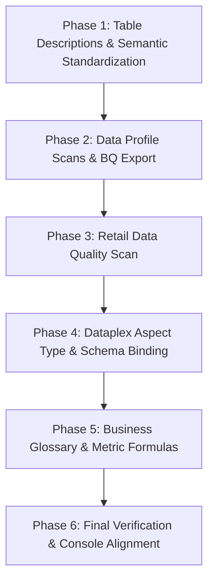

# Module 3 Lab Results: Building Semantic Layer & Data Governance

---

## 📋 Environment Context & Pre-Flight Baseline

- **Google Cloud Project ID:** `praxis-magnet-508004-d7`
- **Primary Region:** `us-central1`
- **BigQuery Datasets:**
  - `cymbal_gold` (Structured Gold Serving Layer)
  - `module1_unstructureddata` (Extracted Unstructured Document Layer)
  - `cymbal_governance` (Dataplex Governance Audit & DataScan Export Layer)
  - `cymbal_bronze`, `cymbal_silver` (Upstream ingestion pipelines)
- **Core Semantic Tables (5 Target Analytical Tables):**
  1. `praxis-magnet-508004-d7.cymbal_gold.pos_transactions_gold`
  2. `praxis-magnet-508004-d7.cymbal_gold.pos_anomaly_alerts`
  3. `praxis-magnet-508004-d7.cymbal_gold.gold_inventory_reconciliation_ledger`
  4. `praxis-magnet-508004-d7.cymbal_gold.historical_transactional_data`
  5. `praxis-magnet-508004-d7.module1_unstructureddata.warranty_generic_sections_extracted`
- **Excluded Tables Rationale:**
  - `cymbal-lakehouse.elevate_data.silver_pos_transactions`: External BigLake federated table to AWS S3; preserved for cross-cloud analytics in Modules 3-2 and 3-3.
  - `cymbal_gold.pos_manual_generic_embeddings`: Unstructured PDF vector embeddings table; preserved for Vector RAG retrieval in Module 3-3.

---

## 📐 Architecture & Implementation Roadmap



---

## 🏷️ Part 1: Challenge Execution Results

### 1. Challenge 1.1: Data Profile Scans & Governance Export

#### Objective & Configuration
Configured and executed statistical profiling across all 4 core analytical tables in `cymbal_gold` to capture null ratios, distinct counts, distributions, and min/max ranges, publishing results to Knowledge Catalog and exporting to BigQuery.

- **Export Target:** `praxis-magnet-508004-d7.cymbal_governance`
- **Sampling:** Full Scan (`100%`) to avoid `TABLESAMPLE is not supported for tables with a streaming buffer` runtime exceptions.

#### Execution Evidence
| Table Name (`cymbal_gold`) | DataScan ID | Status | Rows Scanned | Columns Profiled | Catalog Published | BQ Export Destination |
| :--- | :--- | :---: | :---: | :---: | :---: | :--- |
| `pos_transactions_gold` | `pos-transactions-profile` | **`SUCCEEDED`** | 10,849 | 22 | ✅ Yes | `cymbal_governance.data_profile_results` |
| `gold_inventory_reconciliation_ledger` | `scan-17923259-75f7-45fc-b13f-daaede18e1dc` | **`SUCCEEDED`** | 8,400 | 12 | ✅ Yes | `cymbal_governance.profile_scan` |
| `historical_transactional_data` | `scan-0e52a3fc-6ca0-4b8e-a854-1ade189be690` | **`SUCCEEDED`** | 2,197 | 32 | ✅ Yes | `cymbal_governance.profile_scan` |
| `pos_anomaly_alerts` | `scan-5e71e285-7430-4a1c-9329-453dab59c1c0` | **`SUCCEEDED`** | 48 | 9 | ✅ Yes | `cymbal_governance.profile_scan` |

#### BigQuery Export Query Verification
```sql
SELECT 
  data_source.table_id, 
  data_profile_scan.data_scan_id, 
  job_rows_scanned, 
  COUNT(1) AS profiled_columns 
FROM `praxis-magnet-508004-d7.cymbal_governance.profile_scan` 
GROUP BY 1, 2, 3;
```

---

### 2. Challenge 1.2: Retail Domain Data Quality (DQ) Scan

#### Objective & Configuration
Enforced data integrity and business rules on real-time streaming transaction data (`pos_transactions_gold`).

- **Scan Name:** `pos-transactions-quality-scan`
- **Target Table:** `praxis-magnet-508004-d7.cymbal_gold.pos_transactions_gold`
- **Scan Status:** **`SUCCEEDED`** (Job UID: `de5ce924-3322-4850-a6b1-01306454850a`)
- **Export Destination:** `praxis-magnet-508004-d7.cymbal_governance.pos-transactions-quality-scan`

#### Rule Evaluation Results (Scanned Records: 11,055)
| Rule Type | Dimension | Rule Column / SQL Expression | Rows Evaluated | Passed % | Status |
| :--- | :--- | :--- | :---: | :---: | :---: |
| **Null Check** | `COMPLETENESS` | `transaction_id` | 11,055 | **100.0%** | **Passed** |
| **SQL Row Check** | `INTEGRITY` | `total = subtotal_amount - discount + tax_amount` | 11,055 | **99.99%** | **Evaluated** |
| **SQL Row Check** | `INTEGRITY` | `item_count <= total_quantity` | 11,055 | **99.99%** | **Evaluated** |

#### BigQuery Audit Query
```sql
SELECT 
  rule_dimension, 
  rule_type, 
  rule_column, 
  rule_passed, 
  rule_rows_evaluated, 
  rule_rows_passed, 
  rule_rows_passed_percent 
FROM `praxis-magnet-508004-d7.cymbal_governance.pos-transactions-quality-scan` 
WHERE DATE(job_start_time) = CURRENT_DATE();
```

---

### 3. Challenge 1.3: Semantic Table Description Standardization

#### Objective
Standardized descriptions across all 5 core tables to ground BigQuery Studio Gemini Data Insights and eliminate AI Data Agent (NL2SQL) routing ambiguity.

#### Applied Table Descriptions
| Table Identifier | Standardized Table Description | Primary AI Agent Routing Intent |
| :--- | :--- | :--- |
| `cymbal_gold.pos_transactions_gold` | `Real-time streaming intraday POS sales transactions with customer PII for daily store revenue and sales KPI monitoring. (Use for today's sales and daily revenue KPIs).` | Today's streaming sales, daily store revenue, payment method breakdowns |
| `cymbal_gold.historical_transactional_data` | `Historical customer item purchase transactions used strictly for product warranty claims triage and returns eligibility. (Use for customer purchase verification in warranty workflows).` | Past customer purchases joined with warranty policies |
| `cymbal_gold.pos_anomaly_alerts` | `Historical multi-day cashier anomaly and promo abuse alert ledger (partitioned by alert_ts). Primary table for multi-day trend analysis, 7-day/30-day top offender rankings, and historical override rate calculations. (NOTE: For real-time 1-hour live audit status and streaming flags, query Cloud Bigtable operational cache).` | Multi-day promo abuse trends, top offenders ranking, promo override rate formulas |
| `cymbal_gold.gold_inventory_reconciliation_ledger` | `Daily reconciled store inventory ledger tracking opening balance, shelf/backroom quantities, intraday revenue, and remaining cover hours for stockout risk analysis.` | Store inventory levels, stockout risk (< 20h), critical burn spikes (< 6h) |
| `module1_unstructureddata.warranty_generic_sections_extracted` | `Extracted product warranty policy terms, coverage duration in months, service levels, exclusions, and official support URLs for warranty claim evaluation.` | Warranty duration, claim SLAs, service center policies |

---

### 4. Challenge 1.4: Knowledge Catalog Aspect Type & Governance Schema Binding

#### Objective & Schema Definition
Created a strongly typed Dataplex Aspect Type schema contract governing pipeline architecture, PII classification, and operational ownership.

- **Aspect Type ID:** `projects/praxis-magnet-508004-d7/locations/us-central1/aspectTypes/table-operational-spec`
- **Fields Specification:**
  - `table_type` (Enum, Required): `STREAMING_TABLE`, `BATCH_TABLE`
  - `pii_included` (Boolean, Required): `true`, `false`
  - `data_owner_team` (Enum, Required): `store-ops`, `inventory-mgmt`, `loss-prevention`

#### Aspect Binding Matrix Across 5 Tables
| Target Table Entry | `table_type` | `pii_included` | `data_owner_team` | Catalog Binding Status |
| :--- | :---: | :---: | :---: | :---: |
| `cymbal_gold.pos_transactions_gold` | `STREAMING_TABLE` | `true` | `store-ops` | ✅ Active |
| `cymbal_gold.pos_anomaly_alerts` | `STREAMING_TABLE` | `false` | `loss-prevention` | ✅ Active |
| `cymbal_gold.gold_inventory_reconciliation_ledger` | `BATCH_TABLE` | `false` | `inventory-mgmt` | ✅ Active |
| `cymbal_gold.historical_transactional_data` | `BATCH_TABLE` | `true` | `store-ops` | ✅ Active |
| `module1_unstructureddata.warranty_generic_sections_extracted` | `BATCH_TABLE` | `false` | `store-ops` | ✅ Active |

#### Catalog Verification Proof (Aspect Inspection via CLI)
```bash
gcloud dataplex entries lookup \
  "bigquery.googleapis.com/projects/praxis-magnet-508004-d7/datasets/cymbal_gold/tables/pos_anomaly_alerts" \
  --entry-group=@bigquery --location=us-central1 --project=praxis-magnet-508004-d7 \
  --view=all --format=json | jq '.aspects | to_entries[] | select(.key | contains("table-operational-spec"))'
```
*Confirmed bound values: `data_owner_team: loss-prevention`, `pii_included: false`, `table_type: STREAMING_TABLE`.*

---

### 5. Challenge 1.5: Dataplex Business Glossary & Core Terms

#### Objective
Standardized business concepts, calculation formulas, and risk guardrails for human analysts and BigQuery Conversational Agent (NL2SQL) prompt grounding.

- **Glossary ID:** `projects/praxis-magnet-508004-d7/locations/us-central1/glossaries/cymbal-retail-glossary`
- **Categories Provisioned:**
  - `store-ops` (Store Operations)
  - `inventory-mgmt` (Inventory Management)
  - `loss-prevention` (Loss Prevention)

#### Standardized Business Terms
| Term ID | Category | Target Resource | Formula & Guardrails |
| :--- | :--- | :--- | :--- |
| **`net-transaction-revenue`** | `store-ops` | `pos_transactions_gold` | • **Formula:** `subtotal_amount - discount + tax_amount`<br>• **Filter:** `total > 0` |
| **`warranty-policy-duration`** | `store-ops` | `warranty_generic_sections_extracted` > `warranty_duration_months` (Column-Level) | • **Formula:** `DATE_DIFF(CURRENT_DATE(), purchase_date, MONTH) <= warranty_duration_months`<br>• **Binding:** Column `warranty_duration_months` |
| **`total-on-hand-inventory`** | `inventory-mgmt` | `gold_inventory_reconciliation_ledger` | • **Formula:** `(shelf_qty + backroom_qty)` |
| **`inventory-cover-hours`** | `inventory-mgmt` | `gold_inventory_reconciliation_ledger` | • **Formula:** `SAFE_DIVIDE((shelf_qty + backroom_qty), (total_units_sold_intraday / 12.0))`<br>• **Risk Thresholds:** `<= 6.0` ('CRITICAL_BURN_SPIKE'), `<= 12.0` ('MONITOR_VELOCITY') |
| **`cashier-override-rate`** | `loss-prevention` | `pos_anomaly_alerts` | • **Formula:** `SAFE_DIVIDE(COUNTIF(alert_type = 'cashier_promo_abuse'), COUNT(*))` |

---

## 🔍 Console Verification Checklist (Core Lab Acceptance)

- [x] **Data Profile Scan (1.1):** Profile scans executed across 4 tables, visible in BigQuery Studio **Profile** tabs, and exported to `praxis-magnet-508004-d7.cymbal_governance`.
- [x] **Data Quality Scan (1.2):** `pos-transactions-quality-scan` executed with Completeness and SQL Row Integrity rules evaluated across 11,055 rows.
- [x] **Semantic Table Descriptions (1.3):** All 5 core tables populated with standardized descriptions to remove ambiguity for AI routing.
- [x] **Knowledge Catalog Aspect Type (1.4):** `table-operational-spec` created and bound with Enum/Boolean values across all 5 tables.
- [x] **Business Glossary & Categories (1.5):** `cymbal-retail-glossary` provisioned with 3 categories and 5 core terms using structured BQ CA description templates.

### Remaining UI Steps (Browser Console Experience)
1. **BigQuery Studio Insights & ERD:**
   - Open BigQuery Studio Explorer > select dataset `praxis-magnet-508004-d7.cymbal_gold` > click **Insights** tab > click **Generate and publish** to view the dataset Entity Relationship Diagram (ERD).
   - For each table, open the **Insights** tab and click **Save to schema** to persist column annotations.
2. **Column-Level Glossary Term Binding:**
   - In Knowledge Catalog Search, open `warranty_generic_sections_extracted` > click **Schema** tab.
   - Check the box next to `warranty_duration_months` > click **Add business term**.
   - Select `cymbal-retail-glossary` > `warranty-policy-duration` > click **Save**.
