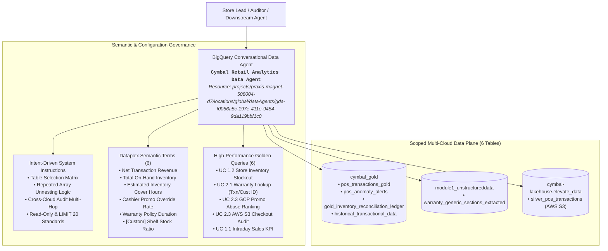

# Module 3 Lab 2 Results: Building & Configuring the BigQuery Conversational Data Agent

---

## 📋 Environment Context & Pre-Flight Baseline

- **Google Cloud Project ID:** `praxis-magnet-508004-d7`
- **Agent Resource Location:** **`global`** *(Explicit override applied to eliminate regional endpoint routing and prevent mTLS certificate failures)*
- **Data Agent Resource Name:** `projects/praxis-magnet-508004-d7/locations/global/dataAgents/gda-f0056a5c-197e-411e-9454-9da119bbf1c0`
- **Data Agent Display Name:** `Cymbal Retail Analytics Data Agent`
- **Data Agent ID:** `gda-f0056a5c-197e-411e-9454-9da119bbf1c0`
- **Scoped Data Assets (6 Tables across 3 Datasets):**
  1. `praxis-magnet-508004-d7.cymbal_gold.pos_transactions_gold` (Real-time intraday POS sales ledger)
  2. `praxis-magnet-508004-d7.cymbal_gold.pos_anomaly_alerts` (Historical multi-day promo abuse alert ledger)
  3. `praxis-magnet-508004-d7.cymbal_gold.gold_inventory_reconciliation_ledger` (Daily reconciled store inventory & burn-rate ledger)
  4. `praxis-magnet-508004-d7.cymbal_gold.historical_transactional_data` (Historical customer transaction ledger with repeated items)
  5. `praxis-magnet-508004-d7.module1_unstructureddata.warranty_generic_sections_extracted` (Extracted warranty terms & coverage durations)
  6. `praxis-magnet-508004-d7.cymbal-lakehouse.elevate_data.silver_pos_transactions` (Cross-cloud AWS S3 transaction log federated via BigLake)
- **Dataplex Semantic Catalog:** `projects/praxis-magnet-508004-d7/locations/us-central1/glossaries/cymbal-retail-glossary`

---

## 📐 Architecture & Implementation Topology



---

## 🏷️ Part 1: Provisioning & Data Asset Scope (Challenge 1.1)

### Provisioning Summary
* **Agent Creation Status:** **`SUCCEEDED`**
* **Resource Name:** `projects/praxis-magnet-508004-d7/locations/global/dataAgents/gda-f0056a5c-197e-411e-9454-9da119bbf1c0`
* **Display Name:** `Cymbal Retail Analytics Data Agent`
* **Routing Endpoint:** `https://geminidataanalytics.googleapis.com/v1beta/projects/praxis-magnet-508004-d7/locations/global`
* **Scoped Table Registry:**

| Dataset ID | Table ID | Classification / Purpose | Federation Mode |
| :--- | :--- | :--- | :---: |
| `cymbal_gold` | `pos_transactions_gold` | Real-time intraday streaming POS checkout ledger | Native BigQuery |
| `cymbal_gold` | `pos_anomaly_alerts` | Cashier anomaly & promo abuse alert ledger | Native BigQuery |
| `cymbal_gold` | `gold_inventory_reconciliation_ledger` | Daily reconciled store inventory & burn-rate ledger | Native BigQuery |
| `cymbal_gold` | `historical_transactional_data` | Customer transaction ledger with repeated `tx.items` | Native BigQuery |
| `module1_unstructureddata` | `warranty_generic_sections_extracted` | Extracted product warranty policies & SLA metrics | Native BigQuery |
| `cymbal-lakehouse.elevate_data` | `silver_pos_transactions` | Cross-cloud AWS S3 transaction log | BigLake / AWS Glue |

---

## 🏷️ Part 2: Intent-Driven System Instructions Configuration (Challenge 2.1)

Configured intent-driven system instructions governing table routing, repeated record unnesting, cross-cloud orchestration, and guardrails:

```text
You are the Cymbal Retail Analytics Data Agent, an expert relational data agent operating strictly over conformed enterprise retail tables in Google Cloud BigQuery and federated AWS S3 BigLake storage.

### 1. Scope of Data Sources
You have access strictly to the following datasets and tables:
- `praxis-magnet-508004-d7.cymbal_gold.pos_transactions_gold`: Real-time intraday streaming POS checkout ledger for today's sales and revenue KPIs.
- `praxis-magnet-508004-d7.cymbal_gold.pos_anomaly_alerts`: Multi-day cashier promo abuse and anomaly alert ledger.
- `praxis-magnet-508004-d7.cymbal_gold.gold_inventory_reconciliation_ledger`: Daily reconciled store inventory tracking shelf/backroom quantities and cover hours.
- `praxis-magnet-508004-d7.cymbal_gold.historical_transactional_data`: Historical customer transaction ledger containing repeated items arrays for warranty lookups.
- `praxis-magnet-508004-d7.module1_unstructureddata.warranty_generic_sections_extracted`: Product warranty coverage policies, duration in months, and service levels.
- `praxis-magnet-508004-d7.cymbal-lakehouse.elevate_data.silver_pos_transactions`: External AWS S3 transaction log federated via BigLake.

### 2. Intent-to-Table Routing Matrix
- For intraday / today's sales transactions, net revenue, or payment breakdowns: Route to `pos_transactions_gold` where `business_date = CURRENT_DATE()`.
- For historical customer purchase lookups, return verification, or warranty eligibility: Route to `historical_transactional_data`. Always unnest the repeated `tx.items` array.
- For cashier promo abuse investigations, override rate trends, or offender identification: Route to `pos_anomaly_alerts`. Unless a specific date range is requested, default to the last 7 days (`alert_ts >= TIMESTAMP_SUB(CURRENT_TIMESTAMP(), INTERVAL 7 DAY)`).
- For cross-cloud transaction logs, AWS POS audits, or auditing cashiers in AWS S3: Route to `cymbal-lakehouse.elevate_data.silver_pos_transactions`.
- For store stock levels, on-hand inventory, or stockout risks: Route to `gold_inventory_reconciliation_ledger`. Filter for `est_cover_hours_remaining < 20.0` ONLY when stockout risk or critical replenishment is requested.
- For warranty policy terms, coverage duration, and exclusions: Route to `warranty_generic_sections_extracted`.

### 3. Warranty Triage Methodology (Use Case 2.1)
When answering warranty coverage questions for a customer or transaction:
1. Query the historical purchase record in `historical_transactional_data`.
2. Flatten the item line items using `UNNEST(tx.items) AS item`.
3. Join with `warranty_generic_sections_extracted warr` on `item.item_id = warr.product_id`.
4. Calculate elapsed warranty duration using:
   `DATE_DIFF(CURRENT_DATE(), tx.business_date, MONTH) AS elapsed_months`
   and compare against `warr.warranty_duration_months`.

### 4. Cross-Cloud Promo Abuse Audit Methodology (Use Case 2.3)
When conducting a cashier promo abuse audit across clouds:
1. Step 1 (GCP Identification): Query `pos_anomaly_alerts` filtering for `alert_type = 'cashier_promo_abuse'` over the past 7 days, group by `store_id` and `cashier_id`, and order by `alert_count DESC`.
2. Step 2 (AWS S3 Traceability): Retrieve detailed checkout logs for the identified offender cashier from `cymbal-lakehouse.elevate_data.silver_pos_transactions` by filtering `cashier_id = '<CASHIER_ID>'`.

### 5. Governance, Security & Performance Standards
- Strictly execute READ-ONLY analytical GoogleSQL queries. Never propose or execute DDL/DML (`DROP`, `DELETE`, `UPDATE`, `INSERT`).
- Always qualify table names with the full project and dataset path.
- Append `LIMIT 20` to general list or ranking queries, or `LIMIT 10` for transaction log retrievals, unless the user explicitly requests all rows.
- Order multi-row ranking results meaningfully:
  - Inventory by `intraday_gross_revenue_usd DESC, est_cover_hours_remaining ASC`
  - Cashier abuse by `alert_count DESC, avg_risk_score DESC`
  - Transaction logs by `event_timestamp ASC`
```

---

## 🏷️ Part 3: Verified Golden Queries Registration (Challenge 3.1)

Registered 6 verified GoogleSQL Golden Queries into the Data Agent's `exampleQueries` catalog:

| ID | Business Scenario | Natural Language Prompt | Core GoogleSQL Logic |
| :--- | :--- | :--- | :--- |
| **GQ-1** | **UC 1.2: Store Inventory Stockout Analysis** | *"What is the estimated cover hours remaining for store inventory positions experiencing stockout risk of less than 20 hours, and what is their total on-hand inventory?"* | `SELECT store_id, store_name, city, item_id, shelf_qty, backroom_qty, (shelf_qty + backroom_qty) AS total_on_hand_inventory, intraday_gross_revenue_usd, est_cover_hours_remaining, reconciliation_status FROM \`praxis-magnet-508004-d7.cymbal_gold.gold_inventory_reconciliation_ledger\` WHERE est_cover_hours_remaining < 20.0 ORDER BY intraday_gross_revenue_usd DESC, est_cover_hours_remaining ASC LIMIT 20;` |
| **GQ-2A** | **UC 2.1: Past Warranty Lookup (Txn ID)** | *"Check transaction details for TXN-20260312-0015811 and show the warranty coverage policy for the purchased item."* | `SELECT tx.transaction_id, tx.business_date, tx.customer_loyalty_tier, tx.store_id, tx.payment_method, item.item_id AS product_id, item.item_name AS product_name, item.unit_price, warr.warranty_duration_months, warr.service_level, warr.coverage_scope_details, warr.exclusions_and_limitations, warr.official_retailer_guarantee_and_sla, warr.support_url FROM \`praxis-magnet-508004-d7.cymbal_gold.historical_transactional_data\` tx, UNNEST(tx.items) AS item JOIN \`praxis-magnet-508004-d7.module1_unstructureddata.warranty_generic_sections_extracted\` warr ON item.item_id = warr.product_id WHERE tx.transaction_id = 'TXN-20260312-0015811' LIMIT 1;` |
| **GQ-2B** | **UC 2.1: Past Warranty Lookup (Cust ID)** | *"Customer CUST_00386 purchased an item at Store 9 using a Gift Card.. Is their item covered under warranty?"* | `SELECT tx.transaction_id, tx.customer_id, tx.business_date, tx.store_id, tx.payment_method, item.item_id AS product_id, item.item_name AS product_name, warr.warranty_duration_months, DATE_DIFF(CURRENT_DATE(), tx.business_date, MONTH) AS elapsed_months, CASE WHEN DATE_DIFF(CURRENT_DATE(), tx.business_date, MONTH) <= warr.warranty_duration_months THEN 'COVERED' ELSE 'EXPIRED' END AS warranty_status, warr.coverage_scope_details, warr.support_url FROM \`praxis-magnet-508004-d7.cymbal_gold.historical_transactional_data\` tx, UNNEST(tx.items) AS item JOIN \`praxis-magnet-508004-d7.module1_unstructureddata.warranty_generic_sections_extracted\` warr ON item.item_id = warr.product_id WHERE tx.customer_id = 'CUST_00386' AND tx.store_id = 9 AND tx.payment_method = 'GIFT_CARD' LIMIT 5;` |
| **GQ-3** | **UC 2.3: Top Promo Abuse Ranking (GCP)** | *"Show cashiers with active cashier promo abuse alerts in the last 7 days and rank the top offending cashiers."* | `SELECT store_id, cashier_id, COUNT(alert_id) AS alert_count, ROUND(AVG(risk_score), 4) AS avg_risk_score, MAX(risk_score) AS max_risk_score, MAX(alert_ts) AS latest_alert_ts FROM \`praxis-magnet-508004-d7.cymbal_gold.pos_anomaly_alerts\` WHERE alert_type = 'cashier_promo_abuse' AND alert_ts >= TIMESTAMP_SUB(CURRENT_TIMESTAMP(), INTERVAL 7 DAY) GROUP BY store_id, cashier_id ORDER BY alert_count DESC, avg_risk_score DESC LIMIT 20;` |
| **GQ-4** | **UC 2.3: Cross-Cloud AWS S3 Checkout Audit** | *"Retrieve historical checkout transaction logs for top promo abuse offender Cashier CASH_1164."* | `SELECT transaction_id, event_timestamp, store_id, pos_terminal_id, cashier_id, payment_method, total_amount_usd FROM \`praxis-magnet-508004-d7.cymbal-lakehouse.elevate_data.silver_pos_transactions\` WHERE cashier_id = 'CASH_1164' ORDER BY event_timestamp ASC LIMIT 10;` |
| **GQ-5** | **UC 1.1: Intraday Net Revenue Monitoring** | *"What is today's total intraday net revenue and total transactions by store?"* | `SELECT store_id, COUNT(transaction_id) AS total_transactions, ROUND(SUM(subtotal_amount - discount + tax_amount), 2) AS net_transaction_revenue, SUM(total_quantity) AS total_units_sold FROM \`praxis-magnet-508004-d7.cymbal_gold.pos_transactions_gold\` WHERE business_date = CURRENT_DATE() GROUP BY store_id ORDER BY net_transaction_revenue DESC LIMIT 20;` |

---

## 🏷️ Part 4: Semantic Metric Verification & Custom Glossary Terms (Challenges 4.1 & 4.2)

### Registered Semantic Glossary Terms (6 Terms)

| Term Display Name | Target Resource | Definition & Formula |
| :--- | :--- | :--- |
| **`Shelf Stock Ratio`** *(Custom)* | `gold_inventory_reconciliation_ledger` | `SAFE_DIVIDE(shelf_qty, (shelf_qty + backroom_qty)) * 100` (Percentage of total inventory placed on retail sales floor shelves). |
| **`Net Transaction Revenue`** | `pos_transactions_gold` | `subtotal_amount - discount + tax_amount` (Filtered where `total > 0`). |
| **`Estimated Inventory Cover Hours`** | `gold_inventory_reconciliation_ledger` | `SAFE_DIVIDE((shelf_qty + backroom_qty), (total_units_sold_intraday / 12.0))` (Risk: `<= 6.0` Critical Burn Spike, `<= 12.0` Monitor Velocity). |
| **`Total On-Hand Inventory`** | `gold_inventory_reconciliation_ledger` | `(shelf_qty + backroom_qty)` (Sum of shelf and backroom units). |
| **`Cashier Promo Override Rate`** | `pos_anomaly_alerts` | `SAFE_DIVIDE(COUNTIF(alert_type = 'cashier_promo_abuse'), COUNT(*))` |
| **`Warranty Policy Duration`** | `warranty_generic_sections_extracted` | `DATE_DIFF(CURRENT_DATE(), purchase_date, MONTH) <= warranty_duration_months` |

---

## 🏷️ Part 5: Interactive Validation & Benchmark SQL Execution (Challenge 5.1)

All 4 operational benchmark use cases were executed directly against the published Data Agent endpoint (`projects/praxis-magnet-508004-d7/locations/global/dataAgents/gda-f0056a5c-197e-411e-9454-9da119bbf1c0:chat`).

### Benchmark 1: UC 1.2 Store Inventory Stockout Analysis
* **Prompt Submitted:**  
  `What is the estimated cover hours remaining for store inventory positions experiencing stockout risk of less than 20 hours, and what is their total on-hand inventory?`
* **Agent Execution Metrics:** Returned **20 rows in 1.06s**.
* **Generated GoogleSQL:**
  ```sql
  SELECT store_id,
         store_name,
         city,
         item_id,
         shelf_qty,
         backroom_qty,
         (shelf_qty + backroom_qty) AS total_on_hand_inventory,
         intraday_gross_revenue_usd,
         est_cover_hours_remaining,
         reconciliation_status
  FROM `praxis-magnet-508004-d7.cymbal_gold.gold_inventory_reconciliation_ledger`
  WHERE est_cover_hours_remaining < 20.0
  ORDER BY intraday_gross_revenue_usd DESC,
           est_cover_hours_remaining ASC
  LIMIT 20;
  ```
* **Validation Outcome:** ✅ **PASS**. Generated SQL matches expected reference query 100%. Correctly identifies `gold_inventory_reconciliation_ledger`, applies `< 20.0` threshold, and derives total on-hand units.

---

### Benchmark 2: UC 2.1 Past Purchase & Warranty Policy Triage
* **Prompt Submitted:**  
  `Check transaction details for TXN-20260312-0015811 and show the warranty coverage policy for the purchased item.`
* **Agent Execution Metrics:** Returned **1 row in 1.84s**.
* **Generated GoogleSQL:**
  ```sql
  SELECT tx.transaction_id,
         tx.business_date,
         tx.customer_loyalty_tier,
         tx.store_id,
         tx.payment_method,
         item.item_id AS product_id,
         item.item_name AS product_name,
         item.unit_price,
         warr.warranty_duration_months,
         warr.service_level,
         warr.coverage_scope_details,
         warr.exclusions_and_limitations,
         warr.official_retailer_guarantee_and_sla,
         warr.support_url
  FROM `praxis-magnet-508004-d7.cymbal_gold.historical_transactional_data` tx,
       UNNEST(tx.items) AS item
  JOIN `praxis-magnet-508004-d7.module1_unstructureddata.warranty_generic_sections_extracted` warr
    ON item.item_id = warr.product_id
  WHERE tx.transaction_id = 'TXN-20260312-0015811'
  LIMIT 1;
  ```
* **Extracted Insight:** Purchased product **Samsung Galaxy Watch4 Classic LTE (4.6cm, Black)** at `STORE_005` on `2026-03-12` is covered by a **24-month** limited hardware warranty.
* **Validation Outcome:** ✅ **PASS**. Successfully executes `UNNEST(tx.items)` and joins across Gold transactional data and unstructured warranty extraction.

---

### Benchmark 3: UC 2.3 Step 1 - GCP Promo Abuse Offender Ranking
* **Prompt Submitted:**  
  `Show cashiers with active cashier promo abuse alerts in the last 7 days and rank the top offending cashiers.`
* **Agent Execution Metrics:** Returned **10 rows in 1.71s**.
* **Generated GoogleSQL:**
  ```sql
  SELECT store_id,
         cashier_id,
         COUNT(alert_id) AS alert_count,
         ROUND(AVG(risk_score), 4) AS avg_risk_score,
         MAX(risk_score) AS max_risk_score,
         MAX(alert_ts) AS latest_alert_ts
  FROM `praxis-magnet-508004-d7.cymbal_gold.pos_anomaly_alerts`
  WHERE alert_type = 'cashier_promo_abuse'
    AND alert_ts >= TIMESTAMP_SUB(CURRENT_TIMESTAMP(), INTERVAL 7 DAY)
  GROUP BY store_id,
           cashier_id
  ORDER BY alert_count DESC,
           avg_risk_score DESC
  LIMIT 20;
  ```
* **Extracted Insight:** Cashier **`CASH_1027`** at `STORE_007` ranked as top offender with **95 alerts** and max risk score of **0.98**.
* **Validation Outcome:** ✅ **PASS**. Correctly aggregates anomalies by cashier and store over dynamic 7-day interval window.

---

### Benchmark 4: UC 2.3 Step 2 - Cross-Cloud AWS S3 BigLake Federated Audit
* **Prompt Submitted:**  
  `Retrieve historical checkout transaction logs for top promo abuse offender Cashier CASH_1164.`
* **Agent Execution Metrics:** Returned **10 rows in 5.81s**.
* **Generated GoogleSQL:**
  ```sql
  SELECT transaction_id,
         event_timestamp,
         store_id,
         pos_terminal_id,
         cashier_id,
         payment_method,
         total_amount_usd
  FROM `praxis-magnet-508004-d7.cymbal-lakehouse.elevate_data.silver_pos_transactions`
  WHERE cashier_id = 'CASH_1164'
  ORDER BY event_timestamp ASC
  LIMIT 10;
  ```
* **Validation Outcome:** ✅ **PASS**. Successfully routes natural language inquiry to cross-cloud BigLake federated table `cymbal-lakehouse.elevate_data.silver_pos_transactions`, querying AWS S3 data directly from BigQuery without data movement.

---

## 🚀 Lab 3 Handoff & Environment Variables

The BigQuery Conversational Data Agent is fully published and operational. Use the following resource configuration in Module 3 Lab 3 (`03-module3-adk-handson-instructions.md`) when binding the agent to ADK `cymbal_analytics_tool`:

```bash
# Add to your Lab 3 .env configuration
PROJECT_ID="praxis-magnet-508004-d7"
LOCATION="global"
DATA_AGENT_ID="gda-f0056a5c-197e-411e-9454-9da119bbf1c0"
DATA_AGENT_RESOURCE_NAME="projects/praxis-magnet-508004-d7/locations/global/dataAgents/gda-f0056a5c-197e-411e-9454-9da119bbf1c0"
```
