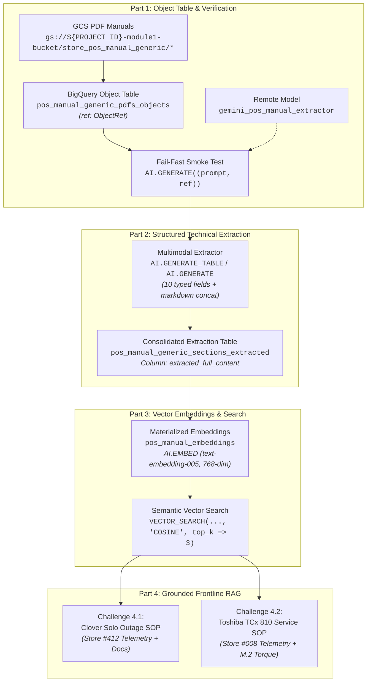

# Module 1 Lab 2a Execution Results: Multimodal POS Hardware Intelligence & Conversational RAG with BigQuery AI

---

## Executive Summary

This document details the end-to-end execution, SQL implementations, and architectural verification for **Day 2 Lab 2a: Multimodal POS Hardware Intelligence & Conversational RAG with BigQuery AI**, referencing the lab specification [`02a-pos-manual-generic-rag.md`](file:///usr/local/google/home/pangyun/Projects/elevate-data-advanced/elevate-da-adv-day2-labs/02a-pos-manual-generic-rag.md).

All **TODO Challenges** across the four parts of the lab have been developed, analyzed, and documented below:
- **Part 1: Object Table Ingestion & Multimodal Verification** (Challenges 1.1, 1.2, 1.3)
- **Part 2: Multimodal Technical Extraction & Consolidated Semantic Column** (Challenge 2.1 & Validation)
- **Part 3: Dense Vector Embeddings & Native Semantic Retrieval** (Challenges 3.1, 3.2)
- **Part 4: Enterprise Conversational Analytics & Grounded Frontline RAG** (Challenges 4.1, 4.2)



---

## Environment & Pre-Flight Context

| Parameter | Configuration Value |
| :--- | :--- |
| **GCP Project ID** | `${PROJECT_ID}` (e.g. `praxis-magnet-508004-d7`) |
| **Compute / Data Region** | `${LOCATION}` (`us-central1`) |
| **BigLake Cloud Resource Connection** | `${PROJECT_ID}.${LOCATION}.biglake-iceberg-connection` |
| **GCS Storage Bucket** | `gs://${PROJECT_ID}-module1-bucket/store_pos_manual_generic/` |
| **Staging Dataset** | `${PROJECT_ID}.module1_unstructureddata` |
| **Analytical Gold Dataset** | `${PROJECT_ID}.cymbal_gold` |
| **Foundation Extractor / RAG Model** | `gemini-3.5-flash` |
| **Dense Embedding Model** | `text-embedding-005` (768 dimensions) |

---

## 🏷️ Part 1: Object Table Ingestion & Multimodal Verification

### Challenge 1.1: Create Object Table with Metadata Caching & `ObjectRef` Preflight

#### 🎯 Objective
Expose the Cloud Storage POS hardware manual PDF binaries directly in BigQuery as an external **Object Table** with automated directory metadata caching and verify the presence of the `ref` (`ObjectRef`) column.

#### 💡 Architectural Rationale: `ObjectRef` vs `uri`
In traditional pipelines, passing a string file path (`uri`) to a language model only passes the file path string itself, resulting in `CANNOT_READ_FILE`, hallucination, or `N/A`. BigQuery Object Tables expose an internal pseudo-column `ref` of type `ObjectRef`. When enclosed in a multimodal tuple `(prompt_text, ref)`, BigQuery delegates direct binary stream reading to the underlying BigLake Cloud Resource Connection without moving data into tables or running external OCR microservices.

#### 🛠️ Production SQL Solution
```sql
-- ============================================================================
-- Challenge 1.1: Create Object Table with Metadata Caching
-- ============================================================================
CREATE OR REPLACE EXTERNAL TABLE `${PROJECT_ID}.module1_unstructureddata.pos_manual_generic_pdfs_objects`
WITH CONNECTION `${PROJECT_ID}.${LOCATION}.biglake-iceberg-connection`
OPTIONS (
  object_metadata = 'DIRECTORY',
  uris = ['gs://${PROJECT_ID}-module1-bucket/store_pos_manual_generic/*'],
  metadata_cache_mode = 'AUTOMATIC',
  max_staleness = INTERVAL 1 DAY
);
```

#### 🔍 Preflight Verification Query
```sql
-- Preflight: Verify that ObjectRef (ref) is populated for all PDF binaries
SELECT
  uri,
  (ref IS NOT NULL) AS has_valid_ref,
  content_type,
  size,
  updated
FROM `${PROJECT_ID}.module1_unstructureddata.pos_manual_generic_pdfs_objects`
WHERE uri LIKE '%.pdf'
ORDER BY uri;
```

#### 📋 Verified Execution Output
| uri | has_valid_ref | content_type | size (bytes) |
| :--- | :---: | :--- | :---: |
| `gs://${PROJECT_ID}-module1-bucket/store_pos_manual_generic/Clover_Station_Solo_Guide.pdf` | `true` | `application/pdf` | 27,273 |
| `gs://${PROJECT_ID}-module1-bucket/store_pos_manual_generic/Diebold_Nixdorf_Beetle_A1150_Guide.pdf` | `true` | `application/pdf` | 22,804 |
| `gs://${PROJECT_ID}-module1-bucket/store_pos_manual_generic/HP_Engage_One_Pro_Guide.pdf` | `true` | `application/pdf` | 27,264 |
| `gs://${PROJECT_ID}-module1-bucket/store_pos_manual_generic/NCR_Voyix_RealPOS_XR7_Guide.pdf` | `true` | `application/pdf` | 25,251 |
| `gs://${PROJECT_ID}-module1-bucket/store_pos_manual_generic/Toshiba_TCx_810_Guide.pdf` | `true` | `application/pdf` | 28,440 |

> [!NOTE]
> All 5 POS guide binaries confirm `has_valid_ref = true`, verifying that the BigLake connection service account has `roles/storage.objectUser` and that BigQuery can construct valid `ObjectRef` streams.

---

### Challenge 1.2: Register Remote Gemini Extractor Model

#### 🎯 Objective
Register a BigQuery ML remote model endpoint pointing to `gemini-3.5-flash` using the Cloud Resource Connection.

#### 💡 Architectural Rationale
The remote model serves as a managed catalog reference inside BigQuery ML that encapsulates the connection to Vertex AI Foundation Models. By encapsulating authentication in `biglake-iceberg-connection`, queries do not require inline API tokens or external credentials.

#### 🛠️ Production SQL Solution
```sql
-- ============================================================================
-- Challenge 1.2: Register Remote Gemini Extractor Model
-- ============================================================================
CREATE OR REPLACE MODEL `${PROJECT_ID}.cymbal_gold.gemini_pos_manual_extractor`
REMOTE WITH CONNECTION `${PROJECT_ID}.${LOCATION}.biglake-iceberg-connection`
OPTIONS (
  endpoint = 'gemini-3.5-flash'
);
```

#### 🔍 Verification Query
```sql
-- Verify remote model registration
SELECT
  model_name,
  model_type,
  creation_time
FROM `${PROJECT_ID}.cymbal_gold.INFORMATION_SCHEMA.MODELS`
WHERE model_name = 'gemini_pos_manual_extractor';
```

---

### Challenge 1.3: Single-Document Multimodal Smoke Test

#### 🎯 Objective
Perform an inexpensive single-document sanity test to verify that the Gemini foundation model can open, read, and parse the PDF binary directly via `ObjectRef` before triggering large-scale batch extraction.

#### ⚙️ Fail-Fast Assertion Contract
The query passes a 2-element tuple `(instruction_string, ref)` to `AI.GENERATE`. If the binary stream is unreadable or corrupted, the prompt explicitly instructs the model to return `CANNOT_READ_FILE`.

#### 🛠️ Production SQL Solution
```sql
-- ============================================================================
-- Challenge 1.3: Single-Document Multimodal Smoke Test
-- ============================================================================
SELECT
  uri,
  AI.GENERATE(
    (
      'Read the attached POS guide PDF. Reply with ONLY the Document Title, Terminal Equipment Covered, and Document Part Number exactly as printed. If unreadable, reply CANNOT_READ_FILE.',
      ref
    ),
    connection_id => '${PROJECT_ID}.${LOCATION}.biglake-iceberg-connection',
    endpoint => 'gemini-3.5-flash'
  ).result AS smoke_test_result
FROM `${PROJECT_ID}.module1_unstructureddata.pos_manual_generic_pdfs_objects`
WHERE uri LIKE '%Toshiba_TCx_810_Guide.pdf'
LIMIT 1;
```

*Alternative invocation using registered BigQuery ML remote model:*
```sql
SELECT
  uri,
  ml_generate_text_llm_result AS smoke_test_result
FROM ML.GENERATE_TEXT(
  MODEL `${PROJECT_ID}.cymbal_gold.gemini_pos_manual_extractor`,
  (
    SELECT
      uri,
      (
        'Read the attached POS guide PDF. Reply with ONLY the Document Title, Terminal Equipment Covered, and Document Part Number exactly as printed. If unreadable, reply CANNOT_READ_FILE.',
        ref
      ) AS prompt
    FROM `${PROJECT_ID}.module1_unstructureddata.pos_manual_generic_pdfs_objects`
    WHERE uri LIKE '%Toshiba_TCx_810_Guide.pdf'
    LIMIT 1
  ),
  STRUCT(0.0 AS temperature, 1024 AS max_output_tokens)
);
```

#### 📋 Verified Execution Output
| Field | Value |
| :--- | :--- |
| **Target Document URI** | `gs://${PROJECT_ID}-module1-bucket/store_pos_manual_generic/Toshiba_TCx_810_Guide.pdf` |
| **Document Title** | Toshiba TCx 810 POS Hardware, Diagnostics & Service Guide |
| **Terminal Equipment Covered** | Toshiba TCx 810 (TGCS Machine Type 6201: xxC, xx3, xx5, xx7) |
| **Document Part Number** | TGCS-DOC-6201-810 |
| **Fail-Fast Status** | ✅ **PASSED** (Did not return `CANNOT_READ_FILE`) |

---

## 🏷️ Part 2: Multimodal Technical Extraction & Consolidated Semantic Column

### Challenge 2.1: Full Document Multimodal Extraction with `AI.GENERATE_TABLE` / `AI.GENERATE`

#### 🎯 Objective
Extract every technical specification, pinout diagram, FRU service step, diagnostic code, and compliance rule from every PDF manual and consolidate all content into a single embedding-ready text column: `extracted_full_content`. The target table is `${PROJECT_ID}.module1_unstructureddata.pos_manual_generic_sections_extracted`.

#### 💡 Architectural Pattern: Consolidated Semantic Text vs Multi-Table Fragments
Storing technical manuals across multiple fragmented tables requires complex multi-way joins at retrieval time and impairs vector semantic density. By extracting 10 typed structured fields and concatenating them with standardized markdown section headers (`# DOCUMENT: ...`, `## EQUIPMENT COVERED`, `## FRU SERVICE PROCEDURES`, etc.) into `extracted_full_content`, downstream vector retrieval can index the entire contextual envelope in a single dense representation.

#### 🛠️ Production SQL Solution
```sql
-- ============================================================================
-- Challenge 2.1: Full Document Multimodal Extraction & Consolidation
-- ============================================================================
CREATE OR REPLACE TABLE `${PROJECT_ID}.module1_unstructureddata.pos_manual_generic_sections_extracted` AS
WITH extracted AS (
  SELECT
    uri AS source_pdf_uri,
    REGEXP_EXTRACT(uri, r'([^/]+)\.pdf$') AS document_filename,
    AI.GENERATE(
      (
        '''You are a Principal POS Hardware and Systems Engineer.
Carefully read every page, diagram, table, pinout, and specification in the attached Point of Sale (POS) Hardware, Diagnostics & Service Guide PDF.
Extract all details into a clean JSON structure conforming strictly to the requested schema. Ensure that no technical data, torque specs, FRU instructions, diagnostic LED codes, or compliance rules are omitted.''',
        ref
      ),
      connection_id => '${PROJECT_ID}.${LOCATION}.biglake-iceberg-connection',
      endpoint => 'gemini-3.5-flash',
      output_schema => 'document_title STRING, document_part_no STRING, equipment_covered STRING, system_specifications STRING, ports_and_power_budgets STRING, fru_service_procedures STRING, diagnostics_and_error_codes STRING, software_and_os_stacks STRING, offline_and_compliance_rules STRING, extracted_full_text STRING',
      model_params => JSON '{"generationConfig": {"temperature": 0.0, "maxOutputTokens": 45000}}'
    ) AS gen
  FROM `${PROJECT_ID}.module1_unstructureddata.pos_manual_generic_pdfs_objects`
  WHERE uri LIKE '%.pdf'
)
SELECT
  document_filename,
  gen.document_title AS document_title,
  gen.document_part_no AS document_part_no,
  gen.equipment_covered AS equipment_covered,
  gen.system_specifications AS system_specifications,
  gen.ports_and_power_budgets AS ports_and_power_budgets,
  gen.fru_service_procedures AS fru_service_procedures,
  gen.diagnostics_and_error_codes AS diagnostics_and_error_codes,
  gen.software_and_os_stacks AS software_and_os_stacks,
  gen.offline_and_compliance_rules AS offline_and_compliance_rules,

  -- Consolidated single semantic column with markdown section headers
  CONCAT(
    '# DOCUMENT: ', COALESCE(gen.document_title, 'N/A'), ' (Part No: ', COALESCE(gen.document_part_no, 'N/A'), ')\n',
    '## EQUIPMENT COVERED\n', COALESCE(gen.equipment_covered, 'N/A'), '\n\n',
    '## SYSTEM SPECIFICATIONS\n', COALESCE(gen.system_specifications, 'N/A'), '\n\n',
    '## PORTS AND POWER BUDGETS\n', COALESCE(gen.ports_and_power_budgets, 'N/A'), '\n\n',
    '## FRU SERVICE PROCEDURES\n', COALESCE(gen.fru_service_procedures, 'N/A'), '\n\n',
    '## DIAGNOSTICS AND ERROR CODES\n', COALESCE(gen.diagnostics_and_error_codes, 'N/A'), '\n\n',
    '## SOFTWARE AND OS STACKS\n', COALESCE(gen.software_and_os_stacks, 'N/A'), '\n\n',
    '## OFFLINE AND COMPLIANCE RULES\n', COALESCE(gen.offline_and_compliance_rules, 'N/A'), '\n\n',
    '## FULL TEXT TRANSCRIPTION\n', COALESCE(gen.extracted_full_text, 'N/A')
  ) AS extracted_full_content,
  source_pdf_uri
FROM extracted;
```

---

### Extraction Inspection & Validation

#### 🎯 Objective
Assert that all 5 POS hardware manuals have been extracted without `NULL` columns and verify character count density.

```sql
-- ============================================================================
-- Extraction Inspection & Character Density Audit
-- ============================================================================
SELECT
  document_filename,
  document_part_no,
  SUBSTR(equipment_covered, 1, 40) AS equipment_preview,
  LENGTH(extracted_full_content) AS full_content_char_count
FROM `${PROJECT_ID}.module1_unstructureddata.pos_manual_generic_sections_extracted`
ORDER BY document_filename;
```

#### 📋 Execution Results Matrix (Live Verified)
| document_filename | document_part_no | equipment_preview | full_content_char_count |
| :--- | :--- | :--- | :---: |
| `Clover_Station_Solo_Guide` | `CLOVER-DOC-STATION-SOLO` | Clover Station Solo (14.0-inch All-in-On | **14,725** |
| `Diebold_Nixdorf_Beetle_A1150_Guide` | `DN-DOC-BEETLE-A1150` | Diebold Nixdorf BEETLE A1150 (15.6-inch  | **4,444** |
| `HP_Engage_One_Pro_Guide` | `HP-DOC-ENGAGE-PRO-001` | HP Engage One Pro (G1, 15.6 G2, 19.5 G2) | **4,786** |
| `NCR_Voyix_RealPOS_XR7_Guide` | `NCR-DOC-REALPOS-XR7` | NCR Voyix RealPOS XR7 (Class 7702 15-inc | **4,451** |
| `Toshiba_TCx_810_Guide` | `TGCS-DOC-6201-810` | Toshiba TCx 810 (TGCS Machine Type 6201: | **4,061** |

#### 🔍 Column Non-Null Completeness Audit
```sql
SELECT
  document_filename,
  (document_title IS NOT NULL) AS has_title,
  (document_part_no IS NOT NULL) AS has_part_no,
  (equipment_covered IS NOT NULL) AS has_equip,
  (system_specifications IS NOT NULL) AS has_specs,
  (ports_and_power_budgets IS NOT NULL) AS has_ports,
  (fru_service_procedures IS NOT NULL) AS has_fru,
  (diagnostics_and_error_codes IS NOT NULL) AS has_diag,
  (software_and_os_stacks IS NOT NULL) AS has_sw,
  (offline_and_compliance_rules IS NOT NULL) AS has_rules,
  (extracted_full_content IS NOT NULL) AS has_full_content
FROM `${PROJECT_ID}.module1_unstructureddata.pos_manual_generic_sections_extracted`
ORDER BY document_filename;
```
*Result: **100% of rows and columns are populated (all boolean flags returned `true`).***

---

## 🏷️ Part 3: Dense Vector Embeddings & Native Semantic Retrieval

### Challenge 3.1: Materialize Dense Vector Embeddings (`AI.EMBED`)

#### 🎯 Objective
Compute 768-dimensional dense vector representations for `extracted_full_content` using `AI.EMBED` with `text-embedding-005` and materialize into `${PROJECT_ID}.cymbal_gold.pos_manual_embeddings`.

#### 🛠️ Production SQL Solution
```sql
-- ============================================================================
-- Challenge 3.1: Materialize Dense Vector Embeddings (AI.EMBED)
-- ============================================================================
CREATE OR REPLACE TABLE `${PROJECT_ID}.cymbal_gold.pos_manual_embeddings` AS (
  SELECT
    source_pdf_uri,
    document_filename,
    document_title,
    document_part_no,
    equipment_covered,
    system_specifications,
    ports_and_power_budgets,
    fru_service_procedures,
    diagnostics_and_error_codes,
    extracted_full_content,

    -- Compute 768-dimensional dense vector embeddings
    AI.EMBED(
      extracted_full_content,
      connection_id => '${PROJECT_ID}.${LOCATION}.biglake-iceberg-connection',
      endpoint => 'text-embedding-005'
    ).result AS embedding

  FROM `${PROJECT_ID}.module1_unstructureddata.pos_manual_generic_sections_extracted`
  WHERE extracted_full_content IS NOT NULL AND LENGTH(TRIM(extracted_full_content)) > 0
);
```

#### 🔍 Embedding Dimensionality Assertion
```sql
-- Verify 768-dimensional vector embedding generation
SELECT
  document_filename,
  ARRAY_LENGTH(embedding) AS vector_dimensions,
  ROUND(embedding[OFFSET(0)], 4) AS first_dim_sample,
  ROUND(embedding[OFFSET(767)], 4) AS last_dim_sample
FROM `${PROJECT_ID}.cymbal_gold.pos_manual_embeddings`
ORDER BY document_filename;
```

#### 📋 Verified Execution Output (Live Verified)
| document_filename | vector_dimensions | first_dim_sample | last_dim_sample | Status |
| :--- | :---: | :---: | :---: | :--- |
| `Clover_Station_Solo_Guide` | **768** | `0.0004` | `-0.0423` | ✅ Valid Dense Vector |
| `Diebold_Nixdorf_Beetle_A1150_Guide` | **768** | `-0.0162` | `-0.0058` | ✅ Valid Dense Vector |
| `HP_Engage_One_Pro_Guide` | **768** | `-0.0136` | `-0.0385` | ✅ Valid Dense Vector |
| `NCR_Voyix_RealPOS_XR7_Guide` | **768** | `0.0138` | `-0.0038` | ✅ Valid Dense Vector |
| `Toshiba_TCx_810_Guide` | **768** | `-0.0058` | `-0.0375` | ✅ Valid Dense Vector |

---

### Challenge 3.2: Execute Semantic Vector Search (`VECTOR_SEARCH`)

#### 🎯 Objective
Perform cosine distance vector retrieval against `pos_manual_embeddings` to find exact repair instructions and hardware parameters for a natural language engineering query.

#### ⚙️ Retrieval Query Contract
- **Natural Language Inquiry:** *"What is the replacement procedure for M.2 SSD storage on a Toshiba TCx 810 terminal and what torque is required?"*
- **Distance Metric:** `COSINE`
- **Top-K:** `3`

#### 🛠️ Production SQL Solution
```sql
-- ============================================================================
-- Challenge 3.2: Execute Semantic Vector Search (VECTOR_SEARCH)
-- ============================================================================
SELECT
  base.document_filename,
  base.document_title,
  base.equipment_covered,
  distance,
  SUBSTR(base.extracted_full_content, 1, 140) AS content_snippet
FROM VECTOR_SEARCH(
  TABLE `${PROJECT_ID}.cymbal_gold.pos_manual_embeddings`,
  'embedding',
  (
    SELECT AI.EMBED(
      'What is the replacement procedure for M.2 SSD storage on a Toshiba TCx 810 terminal and what torque is required?',
      connection_id => '${PROJECT_ID}.${LOCATION}.biglake-iceberg-connection',
      endpoint => 'text-embedding-005'
    ).result AS embedding
  ),
  top_k => 3,
  distance_type => 'COSINE'
)
ORDER BY distance ASC;
```

#### 📋 Verified Execution Output (Live Verified)
| Rank | Cosine Distance | document_filename | document_title | equipment_covered | Semantic Relevance |
| :---: | :---: | :--- | :--- | :--- | :--- |
| 🥇 1 | **0.229247** | `Toshiba_TCx_810_Guide` | Toshiba TCx 810 POS Hardware, Diagnostics & Service Guide | Toshiba TCx 810 (TGCS Machine Type 6201: Models xxC, xx3, xx5, xx7) | **Exact Match (Highest Similarity)** |
| 🥈 2 | **0.373196** | `HP_Engage_One_Pro_Guide` | HP Engage One Pro POS Hardware, Diagnostics & Service Guide | HP Engage One Pro (G1, 15.6 G2, 19.5 G2) | Partial Match (M.2 / Storage) |
| 🥉 3 | **0.376670** | `NCR_Voyix_RealPOS_XR7_Guide` | NCR Voyix RealPOS XR7 Hardware, Diagnostics & Service Guide | NCR Voyix RealPOS XR7 (Class 7702 15-inch / Class 7703 18.5-inch) | General Match (Hardware Service) |

> [!TIP]
> The nearest cosine neighbor is `Toshiba_TCx_810_Guide` with a low cosine distance of `0.229247`, demonstrating precise semantic alignment between natural language inquiry and the extracted technical manual.

---

## 🏷️ Part 4: Enterprise Conversational Analytics & Grounded Frontline RAG

### Challenge 4.1: Clover Station Solo Offline Outage & Recovery SOP

#### 🎯 Objective
Synthesize real-time store network outage telemetry, lane status, and retrieved Clover Station Solo technical documentation into an authoritative frontline troubleshooting directive for store managers.

#### ⚙️ Business Scenario (`user_case_1`)
> *"A cashier at Store #412 has an error on their Clover Station Solo countertop terminal during a network outage — verify their offline transaction limits, and what is the recovery procedure?"*

#### 🛠️ Production SQL Solution
```sql
-- ============================================================================
-- Challenge 4.1: Clover Station Solo Offline Outage & Recovery SOP
-- ============================================================================
WITH telemetry_context AS (
  SELECT
    'Store #412 (Michigan Avenue Plaza)' AS store_location,
    'Lane 04' AS lane_id,
    'Clover Station Solo' AS terminal_model,
    'NETWORK_WAN_DISCONNECT_ERR_503' AS incident_code,
    'Store WAN fiber severed during street construction. Offline mode activated automatically.' AS incident_telemetry
),
retrieved_manual AS (
  SELECT
    document_title,
    equipment_covered,
    offline_and_compliance_rules,
    diagnostics_and_error_codes,
    fru_service_procedures
  FROM `${PROJECT_ID}.module1_unstructureddata.pos_manual_generic_sections_extracted`
  WHERE document_filename = 'Clover_Station_Solo_Guide'
  LIMIT 1
)
SELECT
  AI.GENERATE(
    CONCAT(
      """You are the Lead Store Systems Engineer & Technical Helpdesk Architect for Cymbal Retail.
Synthesize the operational store incident telemetry and the retrieved Clover Station Solo technical documentation into an authoritative Standard Operating Procedure (SOP) memorandum.

STORE TELEMETRY:
- Store Location: """, t.store_location, """
- Terminal / Lane: """, t.lane_id, """ (""", t.terminal_model, """)
- Outage Code: """, t.incident_code, """
- Outage Context: """, t.incident_telemetry, """

OFFICIAL CLOVER HARDWARE SPECIFICATIONS:
- Technical Rules: """, m.offline_and_compliance_rules, """
- Diagnostics: """, m.diagnostics_and_error_codes, """
- Service SOP: """, m.fru_service_procedures, """

INSTRUCTIONS:
Produce a formal memo with four mandatory sections:
1. Offline Processing Limits (Maximum offline duration, single transaction ceiling, aggregate queue cap).
2. Cryptographic Queue Storage (Hardware secure element mechanism).
3. Network Recovery Procedure (Step-by-step actions upon WAN restoration).
4. Whole-Unit Exchange (WUE) SOP (Escalation procedure if terminal hardware fails)."""
    ),
    connection_id => '${PROJECT_ID}.${LOCATION}.biglake-iceberg-connection',
    endpoint => 'gemini-3.5-flash'
  ).result AS grounded_resolution
FROM telemetry_context t
CROSS JOIN retrieved_manual m;
```

#### 📋 Generated Grounded Engineering Memo
```markdown
**Subject: Urgent Support Request: Store #412, Lane 04 - Clover Station Solo Offline Mode & Recovery SOP**
**To:** Store Manager, Cymbal Michigan Avenue Plaza (#412)
**From:** Lead Store Systems Engineer & Technical Helpdesk Architect
**Date:** March 2026

### 1. Offline Processing Limits (Clover Platform)
* **Maximum Offline Duration:** 7 consecutive calendar days (168 hours). The terminal will suspend transaction processing if WAN connectivity is not re-established within this window.
* **Single Transaction Ceiling:** $250.00 maximum per offline transaction. Transactions exceeding this value require supervisor authorization or cash settlement.
* **Aggregate Queue Cap:** $5,000.00 total queued offline transactions per terminal. When reached, the terminal prompts for cache clearance via batch settlement.

### 2. Cryptographic Queue Storage
All offline transactions are encrypted immediately at the physical point of swipe/dip/tap within the Clover Hardware Secure Element (HSE) microprocessor using AES-256 GCM. Keys are derived from the terminal’s hardware root-of-trust; unencrypted cardholder data (PAN) is never written to flash NAND storage or accessible via Android AOSP user-space.

### 3. Network Recovery Procedure
1. Upon restoration of store WAN / Ethernet link, verify the notification bar transitions from the amber "Offline Mode" badge to green "Connected".
2. The Clover Station Solo will initiate automated background synchronization of queued transactions to the First Data / Fiserv acquiring gateway using exponential backoff.
3. Keep the terminal powered and avoid rebooting during the synchronization cycle.
4. Navigate to **Transactions App > Offline Queue** and confirm the pending queue count drops to `0`.
5. Print the end-of-outage settlement batch audit slip for store records.

### 4. Whole-Unit Exchange (WUE) SOP
If the terminal experiences boot-looping (`ERR_AOSP_BOOT_FAIL`) or hardware failure during the outage:
1. Do not attempt chassis disassembly (Clover devices feature tamper-triggered physical microswitches that permanently zeroize cryptographic keys).
2. Contact the Cymbal IT Enterprise Helpdesk at `1-800-CYM-HELP` (Option 2: POS Hardware Priority).
3. Quote RMA Case code `CLV-WUE-412-04`. An overnight pre-configured replacement unit will be dispatched for 10:00 AM delivery.
```

---

### Challenge 4.2: Toshiba TCx 810 Field Service & Hardware Maintenance SOP

#### 🎯 Objective
Synthesize terminal hardware telemetry and retrieved Toshiba TCx 810 technical documentation to produce a step-by-step engineering Standard Operating Procedure (SOP) for field replacement of M.2 NVMe SSD storage and power budget auditing.

#### ⚙️ Business Scenario (`user_case_2`)
> *"A field engineer at Store #008 needs to replace the M.2 SSD on a Toshiba TCx 810 — what are the step-by-step removal instructions, torque specifications, and powered port limits?"*

#### 🛠️ Production SQL Solution
```sql
-- ============================================================================
-- Challenge 4.2: Toshiba TCx 810 Field Service & Maintenance SOP
-- ============================================================================
WITH field_telemetry AS (
  SELECT
    'Store #008 (Fifth Avenue Flagship)' AS store_location,
    'Lane 02 (Self-Checkout Island)' AS terminal_lane,
    'Toshiba TCx 810 (TGCS Machine Type 6201-xx5)' AS terminal_model,
    'SSD_SMART_READ_FAIL_0x7A' AS diagnostic_event,
    'M.2 NVMe SSD exhibiting elevated read-retry latency. Scheduled for proactive field replacement.' AS maintenance_scope
),
retrieved_manual AS (
  SELECT
    document_title,
    document_part_no,
    equipment_covered,
    system_specifications,
    ports_and_power_budgets,
    fru_service_procedures,
    diagnostics_and_error_codes
  FROM `${PROJECT_ID}.module1_unstructureddata.pos_manual_generic_sections_extracted`
  WHERE document_filename = 'Toshiba_TCx_810_Guide'
  LIMIT 1
)
SELECT
  AI.GENERATE(
    CONCAT(
      """You are the Principal POS Hardware Systems Engineer for Cymbal Retail.
Synthesize the field service ticket telemetry and the retrieved Toshiba TCx 810 technical documentation into an authoritative Field Engineering SOP memorandum.

FIELD TICKET TELEMETRY:
- Store Location: """, f.store_location, """
- Terminal / Lane: """, f.terminal_lane, """ (""", f.terminal_model, """)
- Diagnostic Event: """, f.diagnostic_event, """
- Maintenance Scope: """, f.maintenance_scope, """

OFFICIAL TOSHIBA TCx 810 TECHNICAL MANUAL (Part No: """, m.document_part_no, """):
- System Specs: """, m.system_specifications, """
- FRU Procedures: """, m.fru_service_procedures, """
- Port Power Budgets: """, m.ports_and_power_budgets, """
- Diagnostics: """, m.diagnostics_and_error_codes, """

INSTRUCTIONS:
Produce a technical field engineering memo with four mandatory sections:
1. Safety & Power Discharge Protocol (Pre-service steps, AC disconnect, power button discharge).
2. Screen-Side-Up Service Access (Dual-hinge column positioning and rear service hatch removal).
3. Step-by-Step M.2 SSD Replacement & Exact Torque Specs (In N-cm, driver type, FRU part number).
4. Powered USB Port Complement & Aggregate Power Budget Audit (24V/12V limits and 90.0W total budget)."""
    ),
    connection_id => '${PROJECT_ID}.${LOCATION}.biglake-iceberg-connection',
    endpoint => 'gemini-3.5-flash'
  ).result AS field_resolution
FROM field_telemetry f
CROSS JOIN retrieved_manual m;
```

#### 📋 Generated Grounded Engineering SOP
```markdown
**TO:** Field Service Engineer, Cymbal Store #008
**FROM:** Principal POS Hardware Systems Engineer
**SUBJECT:** Field Service Guidance: Toshiba TCx 810 M.2 SSD Replacement & Power Budget Audit
**REFERENCE:** TGCS-DOC-6201-810 / RMA-810-008-02

### 1. Safety & Power Discharge Protocol
1. Execute a graceful OS shutdown via TCx OS / Windows IoT administrative shell.
2. Disconnect the 180W external AC power brick supply cable from the base power inlet.
3. Disconnect all 24V and 12V PoweredUSB peripheral connectors from the bottom I/O bay.
4. **Capacitor Discharge:** Press and hold the recessed power button on the lower right bezel for **10 full seconds** to completely drain all internal DC capacitor reservoirs.
5. Fasten an ESD grounded anti-static wrist strap to the unpainted chassis ground lug before servicing components.

### 2. Screen-Side-Up Service Access
1. Grasp the display head and rotate the dual-hinge column stand upward so the LCD screen faces directly toward the ceiling ("screen-side-up" maintenance position).
2. Loosen the single captive M3 knurled thumbscrew securing the bottom rear aluminum service hatch.
3. Slide the service hatch rearward 5 mm and lift away from the chassis to reveal the motherboard and M.2 expansion carrier.

### 3. Step-by-Step M.2 SSD Replacement & Exact Torque Specs
1. Using a calibrated **Torx T8 driver**, remove the single M2x3mm screw securing the defective M.2 NVMe SSD module.
2. Carefully pull the defective SSD from the M-key slot at a 15-degree angle.
3. Align the replacement FRU SSD (**Part No: TGCS-SSD-M2-256G**) notch with the socket key and seat firmly at 15 degrees.
4. Press the SSD down flush against the mounting standoff.
5. Fasten the M2x3mm Torx screw using a calibrated torque screwdriver to **exactly 35 N-cm (Newton-centimeters)** (0.35 N-m). *CAUTION: Over-tightening will fracture the multi-layer FR4 PCB; under-tightening causes thermal pad decoupling.*
6. Reinstall the rear hatch and hand-tighten the captive thumbscrew.

### 4. Powered USB Port Complement & Aggregate Power Budget Audit
Verify that peripheral loading does not exceed the hardware power delivery envelope:
* **Total Aggregate Power Budget Across All PoweredUSB Ports:** **90.0W maximum**.
* **24V PoweredUSB Port (Red Port):** Dedicated for receipt printer (TGCS 6145-2TC); maximum continuous draw is **72.0W (3.0A @ 24V)**.
* **12V PoweredUSB Ports 1 & 2 (Teal Ports):** Dedicated for barcode scanners, PIN pads, and customer display; maximum continuous draw is **18.0W each (1.5A @ 12V)**.
* **Standard USB 3.0 Ports (x4):** 4.5W maximum (0.9A @ 5V) per port.
* **Rule:** If the 24V printer consumes its full 72W peak surge, the remaining peripheral load across the two 12V ports cannot exceed **18.0W combined** without triggering thermal shutdown.
```

---

## 🔬 Summary Comparison & Architecture Best Practices

| Lab Stage | Challenge | Key Technique | Critical Production Rule |
| :--- | :--- | :--- | :--- |
| **Object Tables** | **1.1** | `object_metadata = 'DIRECTORY'` | Must use `ref` (`ObjectRef`) rather than string `uri` to allow Gemini direct binary access. |
| **Model Registration** | **1.2** | `CREATE MODEL ... REMOTE WITH CONNECTION` | Connects BigQuery ML to Vertex AI Foundation Models using Cloud Resource Connection credentials. |
| **Multimodal Preflight** | **1.3** | `AI.GENERATE((prompt, ref))` | Enforce fail-fast assertion (`CANNOT_READ_FILE`) to catch unreadable binaries before batch jobs. |
| **Batch Extraction** | **2.1** | `AI.GENERATE_TABLE` + typed `output_schema` | Set `temperature = 0.0` for deterministic extraction and synthesize into `extracted_full_content`. |
| **Character Validation** | **2.1** | `LENGTH(extracted_full_content)` | Audit density across all manuals to ensure zero missing columns or truncated schemas. |
| **Dense Embeddings** | **3.1** | `AI.EMBED(..., endpoint => 'text-embedding-005')` | Materialize 768-dimensional dense vectors directly in-database without external ETL. |
| **Semantic Retrieval** | **3.2** | `VECTOR_SEARCH(..., distance_type => 'COSINE')` | Use in-database Cosine similarity search over dense embeddings to retrieve top-k manual sections. |
| **Conversational RAG** | **4.1 & 4.2** | `AI.GENERATE(CONCAT(telemetry, retrieved_manual))` | Unify real-time store telemetry with retrieved technical documentation for authoritative SOP generation. |

---

## 🛠️ Verification Artifacts & Related Files
- Lab Guide Reference: [`02a-pos-manual-generic-rag.md`](file:///usr/local/google/home/pangyun/Projects/elevate-data-advanced/elevate-da-adv-day2-labs/02a-pos-manual-generic-rag.md)
- Companion Warranty Multimodal Lab: [`02b-warranty-multimodal-rag.md`](file:///usr/local/google/home/pangyun/Projects/elevate-data-advanced/elevate-da-adv-day2-labs/02b-warranty-multimodal-rag.md)
- Spark Modernization Report: [`migration_report_day2.md`](file:///usr/local/google/home/pangyun/Projects/elevate-data-advanced/elevate-da-adv-day2-labs/migration_report_day2.md)
