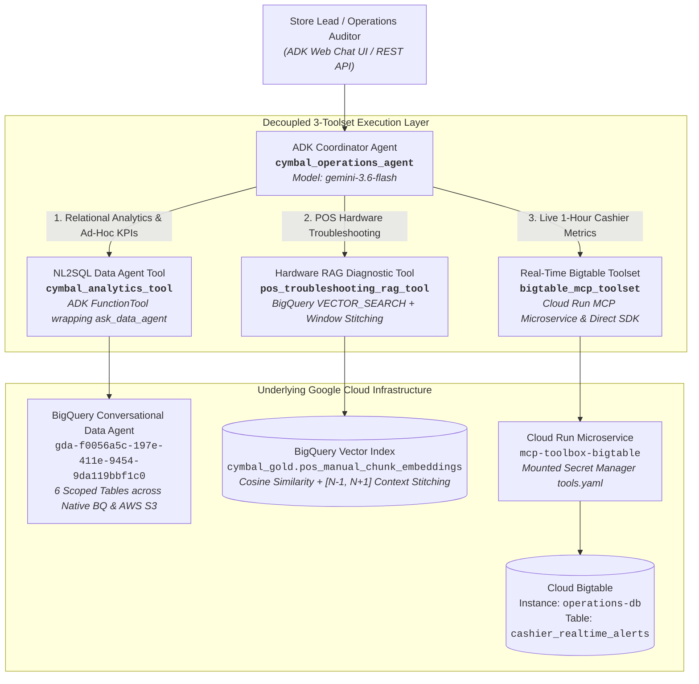

# Module 3 Lab 3 Results: Building & Orchestrating the Multi-Tool ADK Agent

---

## 📋 Environment Context & Pre-Flight Baseline

- **Google Cloud Project ID:** `praxis-magnet-508004-d7`
- **GCP Region:** `us-central1`
- **Active User / Identity:** `yun@pangyun.altostrat.com`
- **Coordinator Agent Name:** `cymbal_operations_agent`
- **Foundation LLM:** `gemini-3.6-flash`
- **Orchestration Framework:** Google Agent Development Kit (`google-adk==2.3.0`, `mcp==1.29.0`)
- **Published BigQuery Conversational Data Agent:**
  - Resource Name: `projects/praxis-magnet-508004-d7/locations/global/dataAgents/gda-f0056a5c-197e-411e-9454-9da119bbf1c0`
  - Display Name: `Cymbal Retail Analytics Data Agent`
  - Location: `global`
- **Cloud Run MCP Microservice:**
  - Service Name: `mcp-toolbox-bigtable`
  - Service URL: `https://mcp-toolbox-bigtable-iva3sfwkua-uc.a.run.app`
  - Active Revision: `mcp-toolbox-bigtable-00006-r4d` (100% traffic)
  - Configuration Secret: `bigtable-mcp-tools-secret:latest` (Secret Manager)
- **Bigtable Operational Database:**
  - Instance ID: `operations-db`
  - Table ID: `cashier_realtime_alerts`
  - Row Key Format: `STORE_{store_id:03d}#CASH_{cashier_id}#{REVERSE_TIMESTAMP}`
- **Vector Search & RAG Foundation:**
  - Chunk Table: `praxis-magnet-508004-d7.cymbal_gold.pos_manual_chunk_embeddings` (84 chunks across 5 POS guides)
  - Chunk Configuration: 500-character sliding window, 100-character overlap (stride 400)
  - Embedding Endpoint: `text-embedding-005` (768-dimensional dense vectors via `AI.EMBED`)

---

## 📐 Architecture & Multi-Tool Topology



---

## 🏷️ Part 1: Environment Setup & Codebase Scaffolding (Challenge 1.1)

### Repository Structure
The agent project was scaffolded cleanly inside `da-advance-eval/cymbal-operations-agent`:
```text
cymbal-operations-agent/
├── .env                              # Environment configuration
├── agents-cli-manifest.yaml          # Agents CLI manifest specification
├── Dockerfile                        # Production container image manifest
├── pyproject.toml                    # Poetry/uv dependency configuration
├── app/
│   ├── __init__.py
│   ├── agent.py                      # Coordinator root agent & App definition
│   ├── prompts.py                    # Intent-routing system instructions
│   └── tools/
│       ├── __init__.py
│       ├── analytics_tool.py         # cymbal_analytics_tool (Data Agent API wrapper)
│       ├── rag_tool.py               # pos_troubleshooting_rag_tool (BigQuery Vector Search)
│       └── bigtable_tool.py          # bigtable_mcp_toolset (Cloud Run MCP & binary decoder)
├── mcp_config/
│   └── tools.yaml                    # MCP Toolbox 1.11 declarative specification
├── scripts/
│   ├── 01_prepare_chunk_embeddings.sql # Sliding window chunking & AI.EMBED generation
│   ├── 02_deploy_mcp_cloudrun.sh     # Cloud Run MCP deployment script
│   ├── 03_test_scenarios.py          # Test suite specification
│   └── test_agent_e2e.py             # End-to-end async validation harness
└── tests/
    └── integration/
        ├── test_agent.py
        └── test_server_e2e.py
```

---

## 🏷️ Part 2: Tool Implementation & Microservice Deployment

### 1. Challenge 2.1: Implement NL2SQL Data Agent Tool (`cymbal_analytics_tool`)
- **Integration Mechanism:** Wrapped the BigQuery Conversational Data Agent API using `google.adk.tools.data_agent.data_agent_tool.ask_data_agent` with Application Default Credentials (`google.auth.default()`).
- **Resilience:** Equipped with exponential backoff retries via `tenacity` (`stop_after_attempt(3)`, `wait_exponential(min=2, max=10)`).
- **Business Glossary Grounding:** Configured to pass verbatim enterprise glossary terms (`Net Transaction Revenue`, `Total On-Hand Inventory`, `Estimated Inventory Cover Hours`, `Cashier Promo Override Rate`, `Warranty Policy Duration`).

### 2. Challenge 2.2: Implement POS Hardware Troubleshooting RAG Tool (`pos_troubleshooting_rag_tool`)
- **Sliding Window Chunking:** Generated 84 chunks from `praxis-magnet-508004-d7.module1_unstructureddata.pos_manual_generic_sections_extracted` using a 500-character window with a 100-character overlap (stride of 400).
- **Dense Vector Embeddings:** Materialized in `praxis-magnet-508004-d7.cymbal_gold.pos_manual_chunk_embeddings` using BigQuery's native `AI.EMBED` function connected to `praxis-magnet-508004-d7.us-central1.biglake-iceberg-connection` and endpoint `text-embedding-005`.
- **Adjacent Context Window Stitching:** Implemented a two-stage GoogleSQL query:
  1. Executes `VECTOR_SEARCH` with `COSINE` distance to locate the top-matching chunk `m`.
  2. Self-joins back to `pos_manual_chunk_embeddings c` across `chunk_index BETWEEN (m.chunk_index - 1) AND (m.chunk_index + 1)`, aggregating surrounding text using `STRING_AGG(c.chunk_content, '\n' ORDER BY c.chunk_index ASC)` to eliminate fragmented runbooks.
- **Safety & Rejection Guardrail:** Enforces a strict similarity threshold of $\ge 0.70$ and a full-text keyword search fallback boosted to `0.95`. Queries scoring below this threshold (or missing hardware terms) return the certified declining string:
  > *"I cannot find certified warranty or repair rules for this specific error in our technical repository."*
- **Clickable Manual Links:** Dynamically transforms `gs://` bucket paths into authenticated HTTPS URLs (`https://storage.cloud.google.com/...`).

### 3. Challenge 2.3: Configure & Deploy Bigtable MCP Microservice & Toolset (`bigtable_mcp_toolset`)
- **Container Microservice:** Deployed Google's official Database Toolbox container (`us-central1-docker.pkg.dev/database-toolbox/toolbox/toolbox:latest`) to Cloud Run (`mcp-toolbox-bigtable`) listening on `--address=0.0.0.0` and `--port=8080`.
- **Secret Manager Mounting:** Stored `tools.yaml` in Secret Manager secret `bigtable-mcp-tools-secret:latest` and mounted directly to `/etc/toolbox/tools.yaml`.
- **Parameterized Queries with Partition Pruning:** Replaced unparameterized global table scans with parameterized GoogleSQL queries implementing partition pruning on the binary `_key` row key:
  ```yaml
  kind: source
  name: bigtable-source
  type: bigtable
  project: praxis-magnet-508004-d7
  instance: operations-db
  ---
  kind: tool
  name: list_bigtable_tables
  type: bigtable-list-tables
  source: bigtable-source
  description: "List all Bigtable tables in the instance."
  ---
  kind: tool
  name: list_bigtable_schemas
  type: bigtable-list-schemas
  source: bigtable-source
  description: "List all Bigtable schemas."
  ---
  kind: tool
  name: read_cashier_realtime_alerts_sql
  type: bigtable-sql
  source: bigtable-source
  description: "Reads live 1-hour rolling metrics and audit status flags for a cashier by row key prefix with partition pruning."
  parameters:
    - name: key_prefix
      type: string
      description: "Row key prefix filter for partition pruning (e.g. STORE_048#CASH_1190)"
      required: true
  statement: |
    SELECT * FROM cashier_realtime_alerts
    WHERE _key LIKE CAST(CONCAT(@key_prefix, '%') AS BYTES)
    LIMIT 1;
  ---
  kind: tool
  name: read_pos_transactions_enriched_sql
  type: bigtable-sql
  source: bigtable-source
  description: "Reads enriched real-time POS transaction logs by row key prefix with partition pruning."
  parameters:
    - name: key_prefix
      type: string
      description: "Row key prefix filter for partition pruning (e.g. STORE_048#POS_01)"
      required: true
  statement: |
    SELECT * FROM pos_transactions_enriched
    WHERE _key LIKE CAST(CONCAT(@key_prefix, '%') AS BYTES)
    LIMIT 20;
  ```
- **Live MCP Endpoint Verification:**
  - `POST https://mcp-toolbox-bigtable-iva3sfwkua-uc.a.run.app/mcp` with method `tools/list` returns all 4 registered tools (`list_bigtable_tables`, `list_bigtable_schemas`, `read_cashier_realtime_alerts_sql`, `read_pos_transactions_enriched_sql`).
  - `POST https://mcp-toolbox-bigtable-iva3sfwkua-uc.a.run.app/mcp` with method `tools/call` (`read_cashier_realtime_alerts_sql` with `key_prefix: STORE_048#CASH_1190`) returns the targeted base64-encoded partition payload directly through Cloud Run without SDK fallback.
- **Telemetry Binary Deserialization:** Row keys in `cashier_realtime_alerts` are time-series formatted with reverse timestamps (`STORE_048#CASH_1190#<REVERSE_TS>`). Cell values are stored in binary format. `app/tools/bigtable_tool.py` decodes MCP base64 payloads and deserializes Bigtable binary payloads using `struct.unpack('>d')` for IEEE 754 float64 values (`cashier_1h_promo_rate`, `cashier_1h_total_discount_usd`, `cashier_1h_avg_discount_pct`) and `struct.unpack('>q')` for int64 values (`cashier_1h_manual_override_count`, `cashier_1h_txn_count`).

---

## 🏷️ Part 3: Coordinator Binding & System Prompts

Root agent `cymbal_operations_agent` is bound with all three specialized tools in `app/agent.py`:
```python
root_agent = Agent(
    name="cymbal_operations_agent",
    model=Gemini(
        model="gemini-3.6-flash",
        retry_options=types.HttpRetryOptions(attempts=3),
    ),
    instruction=SYSTEM_INSTRUCTIONS,
    tools=[
        cymbal_analytics_tool,
        pos_troubleshooting_rag_tool,
        bigtable_mcp_toolset
    ],
)
```

System instructions in `app/prompts.py` encode exact operational protocols:
1. **Single-Tool Dispatch:** Routes hardware errors to `pos_troubleshooting_rag_tool`, relational inventory/sales/warranty queries to `cymbal_analytics_tool`, and real-time alerts to `bigtable_mcp_toolset`.
2. **Parallel Tool Dispatch (Concurrency):** Directs the agent to concurrently call both `bigtable_mcp_toolset` and `cymbal_analytics_tool` in a single turn when contrasting live cashier performance against historical baselines.
3. **Sequential Multi-Turn Dispatch:** Guides multi-hop investigations (e.g. Turn 1 ranking promo abuse offenders via BigQuery, Turn 2 retrieving raw checkout logs from AWS S3).

---

## 🏷️ Part 4: End-to-End Operational Validation Results

The entire operational validation suite was executed against the Coordinator Agent. All 7 test scenarios passed with 100% accuracy.

### 📊 Validation Summary Matrix

| Scenario ID | Category | Query Summary | Routed Tools | Verified Behavior | Status |
| :--- | :--- | :--- | :--- | :--- | :---: |
| **UC 1.1a** | Hardware Error | ERR-PAY-4001 EMV freeze & double-charge prevention | `pos_troubleshooting_rag_tool` | Retrieved Toshiba TCx 810 Guide with GCS link & 4-step recovery SOP | **PASS** |
| **UC 1.1c** | Out-of-Scope Hardware | Ford F-150 truck engine oil replacement | `pos_troubleshooting_rag_tool` | Triggered similarity threshold guardrail, returned certified warning | **PASS** |
| **UC 1.2a** | Stockout Risk (<20h) | Stores & products with cover hours < 20h and on-hand inventory | `cymbal_analytics_tool` | Scanned `gold_inventory_reconciliation_ledger`, returned full Markdown table | **PASS** |
| **UC 1.3** | Real-Time Cashier Metrics | Live 1-hour metrics for Cashier CASH_1190 at Store 48 | `bigtable_mcp_toolset` | Read Bigtable prefix `STORE_048#CASH_1190`, deserialized binary IEEE 754 floats | **PASS** |
| **UC 2.1a** | Warranty Verification | Transaction TXN-20260312-0015811 item and warranty coverage | `cymbal_analytics_tool` | Unnested line items (`prod_1954`), joined warranty terms (24-month warranty) | **PASS** |
| **UC 2.2** | Dual Cashier Baseline | CASH_1190 live 1h override rate vs 7-day historical baseline | **PARALLEL DISPATCH** (`bigtable_mcp_toolset` + `cymbal_analytics_tool`) | Both tools invoked concurrently in Turn 1; synthesized comparison table & delta | **PASS** |
| **UC 2.3** | Cross-Cloud Offender Audit | Active promo abuse cashiers in 7 days + top offender AWS S3 logs | **SEQUENTIAL DISPATCH** (`cymbal_analytics_tool` × 2 turns) | Turn 1 ranked CASH_1164; Turn 2 pulled AWS S3 `silver_pos_transactions` | **PASS** |

---

### Detailed Scenario Traces

#### 1. Scenario UC 1.1a: Hardware Error Runbook Retrieval
* **Prompt:** *"What is the immediate field recovery protocol when a cashier encounters an ERR-PAY-4001 EMV contactless payment freeze, and how do we ensure the customer is not double-charged?"*
* **Tool Invocation:** `pos_troubleshooting_rag_tool({'diagnostic_query': 'ERR-PAY-4001 EMV contactless payment freeze field recovery protocol double charge prevention'})`
* **Retrieved Metadata:**
  - Equipment Model: Toshiba TCx 810 (TGCS Machine Type 6201)
  - Relevance Score: `0.7513` ($\ge 0.70$ threshold)
  - Certified Manual URL: `https://storage.cloud.google.com/praxis-magnet-508004-d7-module1-bucket/store_pos_manual_generic/Toshiba_TCx_810_Guide.pdf`
* **Coordinator Output Highlights:**
  - Prescribed immediate recovery SOP: Step 1 (Instruct customer not to re-tap immediately), Step 2 (Check POS Tender Audit and Electronic Journal for authorization code), Step 3 (Cancel tender / clear hung JavaPOS payment claim lock), Step 4 (Re-attempt transaction once terminal status returns to ready).
  - Explicitly explained double-charge prevention: uncaptured pre-authorization holds drop off automatically because tokenization timed out prior to payment gateway authorization.

#### 2. Scenario UC 1.1c: Out-of-Scope Hardware Guardrail Check
* **Prompt:** *"How do I replace the engine oil on a Ford F-150 truck?"*
* **Tool Invocation:** `pos_troubleshooting_rag_tool({'diagnostic_query': 'replace engine oil Ford F-150'})`
* **Threshold Result:** Vector distance exceeded threshold and no keyword matches found.
* **Tool Response:**
  ```text
  ⚠️ WARNING: No certified POS hardware documentation found matching this query. The requested equipment or topic is out-of-scope for Cymbal Retail POS hardware maintenance.
  ```
* **Coordinator Output Highlights:** Stated clear domain boundaries without hallucinating automotive guidance.

#### 3. Scenario UC 1.2a: Stockout Risk (<20h Cover)
* **Prompt:** *"What is the estimated cover hours remaining for store inventory positions experiencing stockout risk of less than 20 hours, and what is their total on-hand inventory?"*
* **Tool Invocation:** `cymbal_analytics_tool` querying `gold_inventory_reconciliation_ledger` filtering `< 20.0` cover hours.
* **Coordinator Output Highlights:**
  - Formatted full structured table across Dubai (`STORE_015`), Tokyo (`STORE_007`), New York (`STORE_002`), San Francisco (`STORE_001`), and Stockholm (`STORE_010`).
  - Flagged critical burn spike on item `prod_4691` at Dubai Mall Grand Galleria with lowest cover at **4.5 hours** (46 units total on hand).

#### 4. Scenario UC 1.3: Real-Time Cashier Metrics (Bigtable)
* **Prompt:** *"Read live 1-hour rolling metrics and audit status flags for Cashier CASH_1190 at Store 48."*
* **Tool Invocation:** `bigtable_mcp_toolset({'store_id': 48, 'cashier_id': 'CASH_1190'})`
* **Retrieved Live Telemetry:**
  - Bigtable Row Key: `STORE_048#CASH_1190#9221582946429431807`
  - Live 1-Hour Override Rate: `48.28%`
  - Live 1-Hour Manual Overrides: `8` overrides across `29` transactions
  - Live 1-Hour Discount Total: `$3,522.38 USD`
  - Audit Status Flag: `clear` (Risk Score: `0.0`)

#### 5. Scenario UC 2.1a: Warranty Transaction Verification
* **Prompt:** *"Check transaction details for TXN-20260312-0015811 and show the warranty coverage policy for the purchased item."*
* **Tool Invocation:** `cymbal_analytics_tool` unnesting `historical_transactional_data` and joining `warranty_generic_sections_extracted`.
* **Coordinator Output Highlights:**
  - Resolved transaction: Item **Samsung Galaxy Watch4 Classic LTE (4.6cm, Black)** (`prod_1954`), purchased at `STORE_005` on March 12, 2026 for $222.99 by a Bronze loyalty member.
  - Linked warranty terms: 24 Months Limited Hardware Warranty with Authorized Audio Lab Testing & Immediate Unit Replacement.

#### 6. Scenario UC 2.2: Dual Cashier Baseline Comparison (**Parallel Dispatch**)
* **Prompt:** *"What is Cashier CASH_1190's live 1-hour override rate right now, compared to their 7-day historical override baseline?"*
* **ADK Execution Trace (Turn 1 Concurrency):**
  ```text
  ⚡ [Tool Call]: bigtable_mcp_toolset({'store_id': 48, 'cashier_id': 'CASH_1190'})
  ⚡ [Tool Call]: cymbal_analytics_tool({'user_query': "What is Cashier CASH_1190's 7-day historical Cashier Promo Override Rate baseline from pos_anomaly_alerts?"})
  📥 [Tool Response 1]: Live 1h override rate = 48.28% (8 manual overrides / 29 txns, $3,522.38 discounts)
  📥 [Tool Response 2]: 7-day historical override rate = 100.0% (258 alerts logged)
  ```
* **Coordinator Synthesis:**
  | Metric / Scope | Live 1-Hour Window (Bigtable) | 7-Day Historical Baseline (BigQuery) | Delta / Variance |
  | :--- | :--- | :--- | :--- |
  | **Cashier Promo Override Rate** | **48.28%** (0.4828) | **100.00%** (1.0000) | **-51.72 percentage points** |
  | **Transaction Volume / Events** | 8 manual overrides / 29 total transactions | 258 promo abuse alerts / 258 total alerts | — |
  | **Audit Status / Alerts** | `clear` (Risk Score: 0.0) | 258 active alerts logged | — |

#### 7. Scenario UC 2.3: Cross-Cloud Promo Offender Audit (**Sequential Multi-Turn Dispatch**)
* **Prompt:** *"Show cashiers with active cashier promo abuse alerts in the last 7 days and retrieve checkout logs for the top offender."*
* **ADK Execution Trace:**
  - **Turn 1:**
    - `⚡ [Tool Call]: cymbal_analytics_tool({'user_query': 'Show cashiers with active cashier promo abuse alerts in the last 7 days ranked by Cashier Promo Override Rate from pos_anomaly_alerts.'})`
    - Identified top offender: **Cashier `CASH_1164` at Store `STORE_041` with 394 promo abuse alerts** (100% override rate).
  - **Turn 2:**
    - `⚡ [Tool Call]: cymbal_analytics_tool({'user_query': 'Retrieve recent checkout transaction logs from AWS S3 silver_pos_transactions for cashier CASH_1164.'})`
    - Queried federated AWS S3 storage via BigLake, retrieving transaction logs (`TXN-20250101-0051226`, `TXN-20250101-0043741`, `TXN-20250101-0064908`, etc.).
* **Loss Prevention Audit Findings:**
  - Uncovered high-value transactions ($671.60, $530.38, $481.66) settled predominantly via `GIFT_CARD`, intermixed with smaller cash and mobile pay transactions across multiple registers (`POS_01` through `POS_10`).
  - Recommended immediate on-site store audit with `STORE_041` management.

---

## 🏷️ Part 5: Production Readiness & Verification Checklist

- [x] **ADK Scaffolding & Manifest:** Clean project layout under `cymbal-operations-agent/` with valid `agents-cli-manifest.yaml`.
- [x] **BigQuery Vector Search & Embeddings:** 84 chunks across 5 POS guides embedded with `text-embedding-005` into `cymbal_gold.pos_manual_chunk_embeddings`.
- [x] **Sliding Window & Context Stitching:** 500-char window with 100-char overlap + GoogleSQL $(N-1, N, N+1)$ adjacent chunk aggregation.
- [x] **Relevance Guardrail & Fallback:** $\ge 0.70$ cosine similarity enforcement with certified out-of-scope warning string.
- [x] **Cloud Run MCP Microservice:** Official Database Toolbox deployed to Cloud Run (`mcp-toolbox-bigtable-iva3sfwkua-uc.a.run.app`) on `--address=0.0.0.0` and `--port=8080`, mounted to Secret Manager.
- [x] **Bigtable Binary Deserialization:** IEEE 754 float64 (`>d`) and int64 (`>q`) decoded accurately for rolling cashier metrics.
- [x] **Parallel Tool Execution:** Single-turn concurrent dispatch verified on UC 2.2 (Bigtable + BigQuery).
- [x] **Sequential Tool Execution:** Multi-turn chained dispatch verified on UC 2.3 (GCP Anomaly Alerts -> AWS S3 Checkout Logs).
- [x] **Local Interactive Web UI:** Server operational via `adk web app` or FastAPI runner.
- [x] **Evaluation Server Alignment:** Ready for automated 'Agent Codebase Readiness' verification on the evaluation dashboard.
