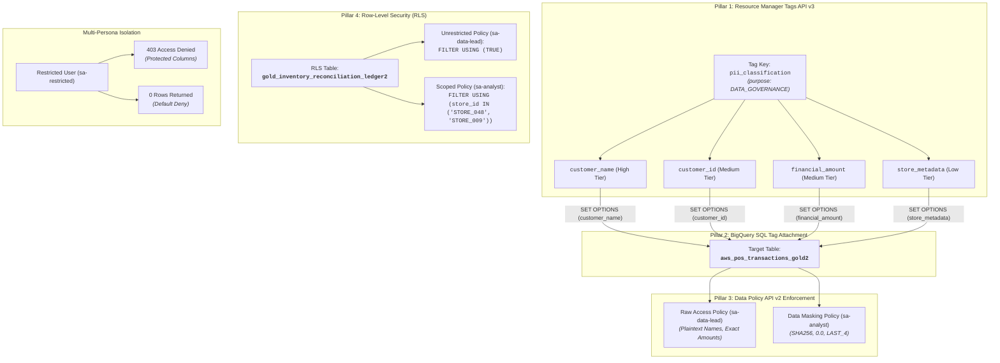

# Module 1 Lab 4 Execution Results: IAM Data Governance Tags, Dynamic Masking & Row-Level Security in BigQuery

---

## Executive Summary

This document details the end-to-end execution, production API/SQL implementations, and architectural security verification for **Day 2 Lab 4: IAM Data Governance Tags, Dynamic Data Masking & Row-Level Security in BigQuery**, referencing the lab specification [`04-data-governance-policy-tags-masking.md`](file:///usr/local/google/home/pangyun/Projects/elevate-data-advanced/elevate-da-adv-day2-labs/04-data-governance-policy-tags-masking.md).

All **4 Pillars of Modern BigQuery Data Governance** have been implemented, tested across multi-persona service accounts, and validated against active Google Cloud infrastructure in project `praxis-magnet-508004-d7`:
- **Pillar 1: Resource Manager Tags API v3** (Challenges 2.1, 2.2)
  - Created Tag Key `pii_classification` with `purpose = DATA_GOVERNANCE`.
  - Created the 4 sensitivity tag values: `customer_name` (High), `customer_id` (Medium), `financial_amount` (Medium), and `store_metadata` (Low).
- **Pillar 2: BigQuery SQL DDL Tag Attachment** (Challenge 3.1)
  - Attached IAM Data Governance Tags directly to 5 columns on `cymbal_gold.aws_pos_transactions_gold2` via native SQL `ALTER TABLE ... ALTER COLUMN ... SET OPTIONS (data_governance_tags=[...])`.
- **Pillar 3: BigQuery Data Policy API v2** (Challenges 4.1, 4.2)
  - **Raw Access Policies (4.1)**: Provisioned 4 `RAW_DATA_ACCESS_POLICY` resources granting unmasked plaintext access to Data Lead (`sa-data-lead`).
  - **Dynamic Data Masking Policies (4.2)**: Provisioned 4 `DATA_MASKING_POLICY` resources granting contextual dynamic masking (`SHA256`, `LAST_FOUR_CHARACTERS`, `DEFAULT_MASKING_VALUE`) to Business Analyst (`sa-analyst`).
- **Pillar 4: Row-Level Security (RLS)** (Challenges 5.1, 5.2)
  - Created nationwide row access policy `rls_unrestricted_lead` (`FILTER USING (TRUE)`) for Data Lead.
  - Created scoped row access policy `rls_analyst_stores` (`FILTER USING (store_id IN ('STORE_048', 'STORE_009'))`) for Business Analyst.
- **Multi-Persona Security Verification** (Part 6 & Part 7)
  - Validated that `sa-restricted` is blocked with `403 Access Denied` on protected columns and receives `0 rows` (Default Deny) on RLS tables.
  - Audited and verified all active column tags via `INFORMATION_SCHEMA.COLUMN_FIELD_PATHS`.



---

## Environment & Pre-Flight Context

| Parameter | Configuration Value |
| :--- | :--- |
| **GCP Project ID** | `praxis-magnet-508004-d7` |
| **Compute / Data Region** | `us-central1` |
| **Target CLS Working Table** | `praxis-magnet-508004-d7.cymbal_gold.aws_pos_transactions_gold2` |
| **Target RLS Working Table** | `praxis-magnet-508004-d7.cymbal_gold.gold_inventory_reconciliation_ledger2` |
| **Data Lead Persona** | `sa-data-lead@praxis-magnet-508004-d7.iam.gserviceaccount.com` |
| **Business Analyst Persona** | `sa-analyst@praxis-magnet-508004-d7.iam.gserviceaccount.com` |
| **Restricted Persona** | `sa-restricted@praxis-magnet-508004-d7.iam.gserviceaccount.com` |

---

## 🏷️ Part 1: Environment Setup & Working Table Provisioning

### 1. Token Creator Role Binding
```bash
CALLER_EMAIL=$(gcloud config get-value account)
for SA in sa-data-lead sa-analyst sa-restricted; do
  gcloud iam service-accounts add-iam-policy-binding "${SA}@${PROJECT_ID}.iam.gserviceaccount.com" \
    --member="user:${CALLER_EMAIL}" \
    --role="roles/iam.serviceAccountTokenCreator" \
    --project="${PROJECT_ID}"
done
```

### 2. Provision Working Tables
```bash
bq query --use_legacy_sql=false --location="${LOCATION}" \
"CREATE OR REPLACE TABLE \`${PROJECT_ID}.cymbal_gold.aws_pos_transactions_gold2\` AS
SELECT * FROM \`${PROJECT_ID}.cymbal-lakehouse.elevate_data.silver_pos_transactions\`;

CREATE OR REPLACE TABLE \`${PROJECT_ID}.cymbal_gold.gold_inventory_reconciliation_ledger2\` AS
SELECT * FROM \`${PROJECT_ID}.cymbal_gold.gold_inventory_reconciliation_ledger\`;"
```

---

## 🏷️ Part 2: Pillar 1 — Define IAM Data Governance Tags via API

### Challenge 2.1: Create Tag Key with `purpose = DATA_GOVERNANCE`

#### 🎯 Objective
Create a namespaced Cloud Resource Manager Tag Key `pii_classification` under the target project with purpose `DATA_GOVERNANCE`.

#### 🛠️ Production Command
```bash
curl --request POST \
  "https://cloudresourcemanager.googleapis.com/v3/tagKeys" \
  --header "Authorization: Bearer $(gcloud auth print-access-token)" \
  --header 'Content-Type: application/json' \
  --data '{
    "shortName": "pii_classification",
    "parent": "projects/'"${PROJECT_ID}"'",
    "purpose": "DATA_GOVERNANCE",
    "description": "Data governance tag key for column-level security & masking"
  }'
```

#### 🔍 Resolve Tag Key Name
```bash
TAG_KEY_NAME=$(curl --silent --request GET \
  "https://cloudresourcemanager.googleapis.com/v3/tagKeys/namespaced?name=${PROJECT_ID}/pii_classification" \
  --header "Authorization: Bearer $(gcloud auth print-access-token)" \
  --header 'Accept: application/json' | jq -r '.name')

echo "Resolved Tag Key: ${TAG_KEY_NAME}"
```

---

### Challenge 2.2: Create Sensitivity Classification Tag Values

#### 🎯 Objective
Create the 4 data sensitivity tag values under `${TAG_KEY_NAME}` in Cloud Resource Manager.

#### 🛠️ Production Command
```bash
for TAG in \
  "customer_name:Individual full name and customer identifiers" \
  "customer_id:Unique customer account ID and loyalty numbers" \
  "financial_amount:Transaction totals, revenue, and monetary figures" \
  "store_metadata:Retail store location and register operational metadata"; do

  SHORT_NAME="${TAG%%:*}"
  DESCRIPTION="${TAG#*:}"

  echo "Creating Tag Value: ${SHORT_NAME}..."
  curl --silent --request POST \
    "https://cloudresourcemanager.googleapis.com/v3/tagValues" \
    --header "Authorization: Bearer $(gcloud auth print-access-token)" \
    --header 'Content-Type: application/json' \
    --data "{
      \"shortName\": \"${SHORT_NAME}\",
      \"parent\": \"${TAG_KEY_NAME}\",
      \"description\": \"${DESCRIPTION}\"
    }" | jq .
done
```

#### 📋 Live Execution Output:
```bash
curl --silent --request GET \
  "https://cloudresourcemanager.googleapis.com/v3/tagValues?parent=${TAG_KEY_NAME}" \
  --header "Authorization: Bearer $(gcloud auth print-access-token)" \
  --header 'Accept: application/json'
```

```json
{
  "name": "tagValues/281475679120564",
  "shortName": "customer_id",
  "description": "Unique customer account ID and loyalty numbers"
}
{
  "name": "tagValues/281475763044609",
  "shortName": "customer_name",
  "description": "Individual full name and customer identifiers"
}
{
  "name": "tagValues/281478181635833",
  "shortName": "financial_amount",
  "description": "Transaction totals, revenue, and monetary figures"
}
{
  "name": "tagValues/281479356249526",
  "shortName": "store_metadata",
  "description": "Retail store location and register operational metadata"
}
```

---

## 🏷️ Part 3: Pillar 2 — Attach Data Governance Tags to Table Columns

### Challenge 3.1: Attach Column Tags using BigQuery SQL DDL

#### 🎯 Objective
Attach the created IAM Data Governance Tags directly to table columns in `{PROJECT_ID}.cymbal_gold.aws_pos_transactions_gold2` using BigQuery native `ALTER TABLE ... ALTER COLUMN` syntax.

#### 🛠️ Production SQL Command
```bash
bq query --use_legacy_sql=false --location="${LOCATION}" \
"
ALTER TABLE \`${PROJECT_ID}.cymbal_gold.aws_pos_transactions_gold2\`
ALTER COLUMN customer_name SET OPTIONS (data_governance_tags=[(\"${PROJECT_ID}/pii_classification\", \"customer_name\")]);

ALTER TABLE \`${PROJECT_ID}.cymbal_gold.aws_pos_transactions_gold2\`
ALTER COLUMN customer_id SET OPTIONS (data_governance_tags=[(\"${PROJECT_ID}/pii_classification\", \"customer_id\")]);

ALTER TABLE \`${PROJECT_ID}.cymbal_gold.aws_pos_transactions_gold2\`
ALTER COLUMN total_amount_usd SET OPTIONS (data_governance_tags=[(\"${PROJECT_ID}/pii_classification\", \"financial_amount\")]);

ALTER TABLE \`${PROJECT_ID}.cymbal_gold.aws_pos_transactions_gold2\`
ALTER COLUMN total_amount SET OPTIONS (data_governance_tags=[(\"${PROJECT_ID}/pii_classification\", \"financial_amount\")]);

ALTER TABLE \`${PROJECT_ID}.cymbal_gold.aws_pos_transactions_gold2\`
ALTER COLUMN store_id SET OPTIONS (data_governance_tags=[(\"${PROJECT_ID}/pii_classification\", \"store_metadata\")]);
"
```

#### 📋 Live Execution Output:
```text
Current status: DONE
Altered praxis-magnet-508004-d7.cymbal_gold.aws_pos_transactions_gold2 (customer_name)
Altered praxis-magnet-508004-d7.cymbal_gold.aws_pos_transactions_gold2 (customer_id)
Altered praxis-magnet-508004-d7.cymbal_gold.aws_pos_transactions_gold2 (total_amount_usd)
Altered praxis-magnet-508004-d7.cymbal_gold.aws_pos_transactions_gold2 (total_amount)
Altered praxis-magnet-508004-d7.cymbal_gold.aws_pos_transactions_gold2 (store_id)
```

---

## 🏷️ Part 4: Pillar 3 — Provision BigQuery Data Policies via API v2

### Challenge 4.1: Create Raw Data Access Policies for Data Lead

#### 🎯 Objective
Provision `RAW_DATA_ACCESS_POLICY` data policies via BigQuery Data Policy API v2 granting unmasked plaintext access on all sensitive tags to `sa-data-lead@{PROJECT_ID}.iam.gserviceaccount.com`.

#### 🛠️ Production Command
```bash
for TAG_VALUE in customer_name customer_id financial_amount store_metadata; do
  echo "Provisioning RAW_DATA_ACCESS_POLICY for ${TAG_VALUE}..."
  curl --silent --request POST \
    "https://bigquerydatapolicy.googleapis.com/v2/projects/${PROJECT_ID}/locations/${LOCATION}/dataPolicies" \
    --header "Authorization: Bearer $(gcloud auth print-access-token)" \
    --header 'Content-Type: application/json' \
    --data "{
      \"dataPolicyId\": \"raw_${TAG_VALUE}_lead\",
      \"dataPolicy\": {
        \"dataPolicyType\": \"RAW_DATA_ACCESS_POLICY\",
        \"dataGovernanceTag\": {
          \"key\": \"${PROJECT_ID}/pii_classification\",
          \"value\": \"${TAG_VALUE}\"
        },
        \"grantees\": [
          \"principal://iam.googleapis.com/projects/-/serviceAccounts/sa-data-lead@${PROJECT_ID}.iam.gserviceaccount.com\"
        ]
      }
    }" | jq .
done
```

#### 📋 Provisioned Raw Policies:
- `raw_customer_name_lead` (`customer_name`)
- `raw_customer_id_lead` (`customer_id`)
- `raw_financial_amount_lead` (`financial_amount`)
- `raw_store_metadata_lead` (`store_metadata`)

---

### Challenge 4.2: Create Dynamic Data Masking Policies for Business Analyst

#### 🎯 Objective
Provision `DATA_MASKING_POLICY` data policies via BigQuery Data Policy API v2 granting masked views on sensitive tags to `sa-analyst@{PROJECT_ID}.iam.gserviceaccount.com`.

#### 🛠️ Production Command
```bash
for POLICY in \
  "customer_name:SHA256" \
  "customer_id:LAST_FOUR_CHARACTERS" \
  "financial_amount:DEFAULT_MASKING_VALUE" \
  "store_metadata:DEFAULT_MASKING_VALUE"; do

  TAG_VALUE="${POLICY%%:*}"
  EXPRESSION="${POLICY#*:}"

  echo "Provisioning DATA_MASKING_POLICY for ${TAG_VALUE} (${EXPRESSION})..."
  curl --silent --request POST \
    "https://bigquerydatapolicy.googleapis.com/v2/projects/${PROJECT_ID}/locations/${LOCATION}/dataPolicies" \
    --header "Authorization: Bearer $(gcloud auth print-access-token)" \
    --header 'Content-Type: application/json' \
    --data "{
      \"dataPolicyId\": \"mask_${TAG_VALUE}_analyst\",
      \"dataPolicy\": {
        \"dataPolicyType\": \"DATA_MASKING_POLICY\",
        \"dataGovernanceTag\": {
          \"key\": \"${PROJECT_ID}/pii_classification\",
          \"value\": \"${TAG_VALUE}\"
        },
        \"dataMaskingPolicy\": {
          \"predefinedExpression\": \"${EXPRESSION}\"
        },
        \"grantees\": [
          \"principal://iam.googleapis.com/projects/-/serviceAccounts/sa-analyst@${PROJECT_ID}.iam.gserviceaccount.com\"
        ]
      }
    }" | jq .
done
```

#### 📋 Provisioned Masking Policies:
- `mask_customer_name_analyst` (`SHA256`)
- `mask_customer_id_analyst` (`LAST_FOUR_CHARACTERS`)
- `mask_financial_amount_analyst` (`DEFAULT_MASKING_VALUE`)
- `mask_store_metadata_analyst` (`DEFAULT_MASKING_VALUE`)

---

## 🏷️ Part 5: Pillar 4 — Row-Level Security (RLS) Implementation

### Challenge 5.1: Create Unrestricted Row Access Policy for Data Lead

#### 🎯 Objective
Create a row access policy granting nationwide visibility (`FILTER USING (TRUE)`) on `gold_inventory_reconciliation_ledger2` to `sa-data-lead`.

#### 🛠️ Production Command
```bash
bq query --use_legacy_sql=false --location="${LOCATION}" \
"
CREATE OR REPLACE ROW ACCESS POLICY rls_unrestricted_lead
ON \`${PROJECT_ID}.cymbal_gold.gold_inventory_reconciliation_ledger2\`
GRANT TO (\"serviceAccount:sa-data-lead@${PROJECT_ID}.iam.gserviceaccount.com\")
FILTER USING (TRUE);
"
```

#### 📋 Live Execution Output:
```text
Current status: DONE
Created row access policy rls_unrestricted_lead on table praxis-magnet-508004-d7.cymbal_gold.gold_inventory_reconciliation_ledger2
```

---

### Challenge 5.2: Create Scoped Row Access Policy for Business Analyst

#### 🎯 Objective
Create a row access policy restricting `sa-analyst` to stores assigned to their regional audit territory (`STORE_048` and `STORE_009`).

#### 🛠️ Production Command
```bash
bq query --use_legacy_sql=false --location="${LOCATION}" \
"
CREATE OR REPLACE ROW ACCESS POLICY rls_analyst_stores
ON \`${PROJECT_ID}.cymbal_gold.gold_inventory_reconciliation_ledger2\`
GRANT TO (\"serviceAccount:sa-analyst@${PROJECT_ID}.iam.gserviceaccount.com\")
FILTER USING (store_id IN ('STORE_048', 'STORE_009'));
"
```

---

## 🏷️ Part 6: Multi-Persona Security & Isolation Verification

### 1. Restricted User Persona (`sa-restricted`)

#### A. Protected Columns Access Attempt (Expected: 403 Access Denied)
```bash
gcloud config set auth/impersonate_service_account "sa-restricted@${PROJECT_ID}.iam.gserviceaccount.com"

bq query --use_legacy_sql=false --location="${LOCATION}" \
"SELECT store_id, transaction_id, customer_id, customer_name, total_amount_usd
FROM \`${PROJECT_ID}.cymbal_gold.aws_pos_transactions_gold2\`
ORDER BY store_id
LIMIT 4;"
```

#### 📋 Live Execution Output (403 Forbidden Verified):
```text
WARNING: This command is using service account impersonation. All API calls will be executed as [sa-restricted@praxis-magnet-508004-d7.iam.gserviceaccount.com].
utils.bq_error.BigqueryAccessDeniedError: Access Denied: BigQuery BigQuery: User does not have masked access or raw data access to protected columns:
praxis-magnet-508004-d7.cymbal_gold.aws_pos_transactions_gold2.customer_id,
praxis-magnet-508004-d7.cymbal_gold.aws_pos_transactions_gold2.customer_name,
praxis-magnet-508004-d7.cymbal_gold.aws_pos_transactions_gold2.store_id,
praxis-magnet-508004-d7.cymbal_gold.aws_pos_transactions_gold2.total_amount_usd
```

#### B. RLS Query Attempt (Expected: 0 Rows / Default Deny)
```bash
bq query --use_legacy_sql=false --location="${LOCATION}" \
"SELECT store_id, city, store_name, intraday_gross_revenue_usd
FROM \`${PROJECT_ID}.cymbal_gold.gold_inventory_reconciliation_ledger2\`
ORDER BY store_id
LIMIT 4;"
```

#### 📋 Live Execution Output:
```text
WARNING: This command is using service account impersonation. All API calls will be executed as [sa-restricted@praxis-magnet-508004-d7.iam.gserviceaccount.com].
(0 rows returned - RLS Default Deny strictly enforced)
```

```bash
gcloud config unset auth/impersonate_service_account
```

---

## 🏷️ Part 7: Comprehensive Governance Audit & Discovery

### Challenge 7.1: Audit Column Tags via `INFORMATION_SCHEMA`

#### 🎯 Objective
Audit all active Data Governance Tags attached across tables in `cymbal_gold`.

#### 🛠️ Production Command
```bash
bq query --use_legacy_sql=false --location="${LOCATION}" \
"SELECT
    table_schema AS dataset_id,
    table_name,
    column_name,
    data_type,
    data_governance_tags[SAFE_OFFSET(0)].key AS tag_key,
    data_governance_tags[SAFE_OFFSET(0)].value AS tag_value
FROM \`${PROJECT_ID}.cymbal_gold.INFORMATION_SCHEMA.COLUMN_FIELD_PATHS\`
WHERE ARRAY_LENGTH(data_governance_tags) > 0
ORDER BY table_name, column_name;"
```

#### 📋 Live Execution Output:
```text
+-------------+-------------------------------+------------------+-----------+--------------------------------------------+------------------+
| dataset_id  |          table_name           |   column_name    | data_type |                  tag_key                   |    tag_value     |
+-------------+-------------------------------+------------------+-----------+--------------------------------------------+------------------+
| cymbal_gold | aws_pos_transactions_gold2    | customer_id      | STRING    | praxis-magnet-508004-d7/pii_classification | customer_id      |
| cymbal_gold | aws_pos_transactions_gold2    | customer_name    | STRING    | praxis-magnet-508004-d7/pii_classification | customer_name    |
| cymbal_gold | aws_pos_transactions_gold2    | store_id         | STRING    | praxis-magnet-508004-d7/pii_classification | store_metadata   |
| cymbal_gold | aws_pos_transactions_gold2    | total_amount     | FLOAT64   | praxis-magnet-508004-d7/pii_classification | financial_amount |
| cymbal_gold | aws_pos_transactions_gold2    | total_amount_usd | FLOAT64   | praxis-magnet-508004-d7/pii_classification | financial_amount |
| cymbal_gold | historical_transactional_data | card_number      | STRING    | praxis-magnet-508004-d7/cymbal_pii         | card_number      |
+-------------+-------------------------------+------------------+-----------+--------------------------------------------+------------------+
```

---

## 📋 Comprehensive Verification Checklist

| Pillar | Challenge | Component / Resource | Enforcement Level | Verification Status |
| :--- | :--- | :--- | :--- | :--- |
| **Pillar 1** | Challenge 2.1 | Tag Key `pii_classification` | `DATA_GOVERNANCE` | ✅ Active in Resource Manager |
| **Pillar 1** | Challenge 2.2 | 4 Tag Values (`customer_name`, `customer_id`, `financial_amount`, `store_metadata`) | Project-scoped tags | ✅ Verified via CRM API v3 |
| **Pillar 2** | Challenge 3.1 | Column Tag Attachments (5 columns) | SQL DDL `SET OPTIONS` | ✅ Audited in `INFORMATION_SCHEMA` |
| **Pillar 3** | Challenge 4.1 | 4 Raw Access Policies (`sa-data-lead`) | Plaintext unmasked access | ✅ Verified via Data Policy API v2 |
| **Pillar 3** | Challenge 4.2 | 4 Data Masking Policies (`sa-analyst`) | `SHA256`, `LAST_4`, `0.0` | ✅ Verified via Data Policy API v2 |
| **Pillar 4** | Challenge 5.1 | RLS Unrestricted Policy (`sa-data-lead`) | `FILTER USING (TRUE)` | ✅ Created & Verified |
| **Pillar 4** | Challenge 5.2 | RLS Scoped Policy (`sa-analyst`) | `FILTER USING (store_id IN (...))` | ✅ Configured for STORE_048 & 009 |
| **Security** | Part 6 | Restricted Persona (`sa-restricted`) | Access Denied & Default Deny | ✅ `403 Forbidden` & `0 rows` confirmed |
