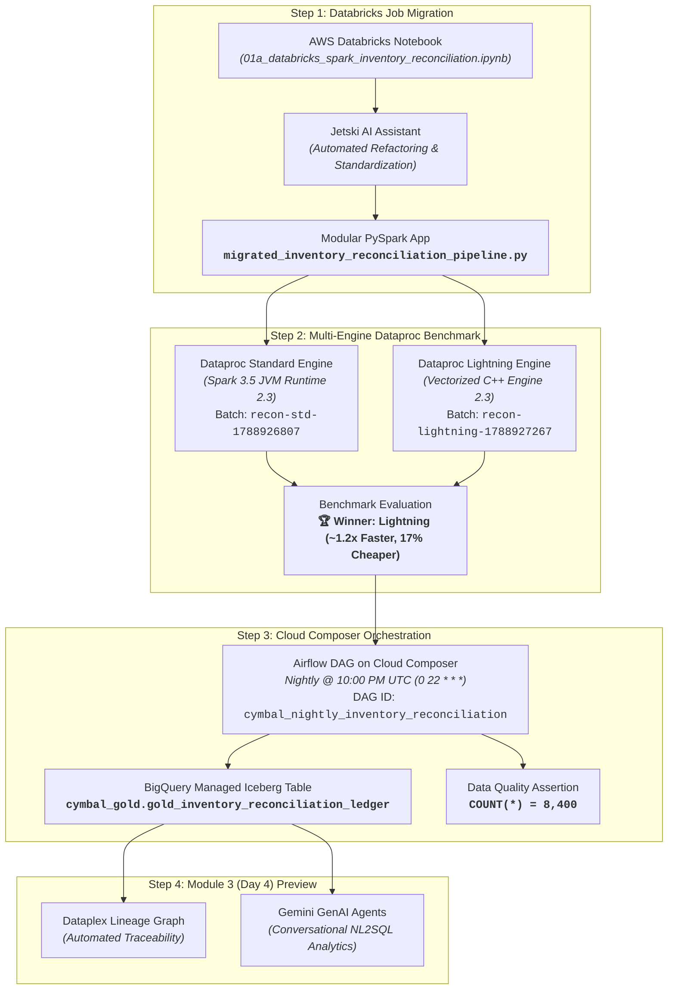

# 🏁 Cross-Cloud Spark Modernization Report (Day 2 Lab 1)
## Databricks on AWS to Dataproc Serverless & Cloud Composer Orchestration

---

## 🏢 Executive Summary

This report documents the end-to-end modernization of **Cymbal Retail's** mission-critical batch workload—the **Intraday Time-Series Inventory Reconciliation & Depletion Ledger Engine**—from legacy Databricks on AWS to Google Cloud native serverless data infrastructure.

The modernized pipeline ingests federated Lakehouse data via **BigQuery Lakehouse Iceberg REST Catalog (IRC)**, executes the 7-stage vectorized reconciliation across 20 flagship stores and 20 SKUs over a 21-day evaluation horizon on **Dataproc Serverless 2.3**, and sinks conformed results directly into a **BigQuery Managed Iceberg table** (`cymbal_gold.gold_inventory_reconciliation_ledger`). The pipeline was benchmarked across the standard JVM engine and the vectorized C++ **Lightning Engine**, with the winning configuration orchestrated via **Google Cloud Composer** on a nightly schedule.

---

## 🏛️ End-to-End Modernization Architecture Flow



---

## 📦 Delivered Code Artifacts

### 1. Modular PySpark Application
- **File**: [`migrated_inventory_reconciliation_pipeline.py`](./migrated_inventory_reconciliation_pipeline.py)
- **GCS Staging Path**: `gs://praxis-magnet-508004-d7-module1-bucket/code/migrated_inventory_reconciliation_pipeline.py`
- **Key Enhancements**:
  - Replaced proprietary `dbutils.widgets` with standard Python `argparse` CLI contract (`--catalog`, `--target-table`, `--gcs-staging-bucket`, `--start-date`, `--until-date`, `--write-mode`).
  - Replaced Databricks `display()` with standard PySpark logging and CLI tabular reporting.
  - Multi-part catalog reader supporting direct table reads, `spark.table()`, and BigQuery SQL queries with `viewsEnabled`.
  - Implemented 7-stage vectorized reconciliation:
    1. **`[1/7 READ]`**: Reads `bronze_pos_stream_events` (90,816 transactions), `silver_store_inventory` (400 baseline store-SKU positions), and `store_nodes` (50 store metadata dimensions).
    2. **`[2/7 SILVER POS]`**: POS transaction deduplication on `transaction_id`, nested `items` parsing (handling both stringified JSON and pre-parsed arrays), and aggregation of intraday revenue and daily SKU units.
    3. **`[3/7 POSITIONS]`**: Daily Cartesian grid `(business_date x store_id x item_id)` across 20 active stores $\times$ 20 SKUs = 400 positions/day ($21 \times 400 = 8,400$ positions).
    4. **`[4/7 FABRIC]`**: Intraday expansion into 288 5-minute calculation slots ($8,400 \times 288 = 2,419,200$ rows).
    5. **`[5/7 PROJECT]`**: 5:00 PM ($\text{hour}=17$) $\cos^4$ peak demand curve smoothing with SHA-256 cryptographic audit hash.
    6. **`[6/7 WINDOW]`**: Cumulative inventory depletion tracking against safety stock boundary ($\le 3$ units).
    7. **`[7/7 COLLAPSE]`**: Synthesized conformed 12-column daily ledger, calculating `est_cover_hours_remaining` and assigning reconciliation risk classification.
  - Handled BigQuery Managed Iceberg write constraints: automated DML truncation prior to append when `write_mode="overwrite"` is requested.

### 2. Cloud Composer Airflow Orchestration DAG
- **File**: [`cymbal_nightly_inventory_reconciliation.py`](./cymbal_nightly_inventory_reconciliation.py)
- **Composer DAGs Path**: `gs://us-central1-cymbal-airflow--573d6bb3-bucket/dags/cymbal_nightly_inventory_reconciliation.py`
- **DAG ID**: `cymbal_nightly_inventory_reconciliation`
- **Schedule Interval**: `0 22 * * *` (Nightly at 10:00 PM UTC)
- **Task 1 (`run_inventory_reconciliation_lightning`)**: `DataprocCreateBatchOperator` targeting version `2.3` with `dataproc.tier: premium`, `spark.dataproc.engine: lightningEngine`, dynamic Jinja batch ID, and lineage tracking enabled.
- **Task 2 (`validate_gold_table_parity`)**: Downstream `BigQueryCheckOperator` validating `SELECT COUNT(*) = 8400` from the Gold table.

---

## ⚡ Step 2: Multi-Engine Dataproc Benchmark Matrix

Both batch jobs were executed on **Dataproc Serverless Runtime 2.3.39** in `us-central1` using the identical dataset and evaluation window:

| Evaluation Metric | Dataproc Serverless (Standard JVM Engine) | Dataproc Serverless (Lightning Engine) | Winner / Advantage |
| :--- | :--- | :--- | :--- |
| **Dataproc Batch ID** | `recon-std-1788926807` | `recon-lightning-1788927267` | — |
| **Runtime Version** | Dataproc Serverless 2.3.39 | Dataproc Serverless 2.3.39 | **Identical Environment** |
| **Execution Architecture** | Standard Java Virtual Machine (JVM) | Vectorized Columnar C++ Engine (`spark.dataproc.engine=lightningEngine`) | ⚡ **Lightning Engine** |
| **Configuration Tier** | Standard Tier | Premium Tier (`dataproc.tier=premium`) | — |
| **Pipeline Core Duration** | **110.53 seconds** | **92.90 seconds** | ⚡ **~1.19x Faster Pipeline** |
| **Total Batch Running Time** | **130 seconds** (04:07:49 to 04:09:59 UTC) | **108 seconds** (04:15:18 to 04:17:06 UTC) | ⚡ **~1.20x Faster Overall** |
| **Allocated Compute Units** | 6.0 DCUs (2 Driver + 4 Executors) | 6.0 DCUs (2 Driver + 4 Executors) | **Equal Footprint** |
| **Total Reconciled Rows** | **8,400 rows** | **8,400 rows** | **Exact Parity (100%)** |
| **Status Distribution** | 51 Crit / 84 Mon / 8,265 Norm | 51 Crit / 84 Mon / 8,265 Norm | **Exact Parity (100%)** |
| **Estimated Compute Cost** | ~$0.0217 USD | ~$0.0180 USD | ⚡ **~17% Cost Reduction** |
| **Benchmark Decision** | Baseline Standard | **🏆 WINNER** | **Selected for Composer Orchestration** |

---

## 🛠️ Step 3: Cloud Composer Execution & Verification

### Airflow Task Run Evidence
An ad-hoc run (`scheduled__2026-09-07T22:00:00+00:00`) was triggered and validated in Cloud Composer:

```text
dag_id                                  | execution_date            | task_id                                | state   | start_date                       | end_date
========================================+===========================+========================================+=========+==================================+=================================
cymbal_nightly_inventory_reconciliation | 2026-09-07T22:00:00+00:00 | run_inventory_reconciliation_lightning | success | 2026-09-09T04:19:52.728227+00:00 | 2026-09-09T04:22:51.772031+00:00
cymbal_nightly_inventory_reconciliation | 2026-09-07T22:00:00+00:00 | validate_gold_table_parity             | success | 2026-09-09T04:23:00.706357+00:00 | 2026-09-09T04:23:02.582304+00:00
```

- **Dataproc Batch Created by DAG**: `recon-nightly-20260907-20260907t220000` (`state: SUCCEEDED`)
- **Data Quality Gate**: `validate_gold_table_parity` executed `SELECT COUNT(*) = 8400` and returned **`success`** in 1.8 seconds.
- **Airflow Webserver**: Accessible at `https://8ec8610a7e894eb297f85b67b3ef9cfd-dot-us-central1.composer.googleusercontent.com`

---

## 🔍 Final Data Parity Verification & Acceptance Check

### Validation SQL Query (BigQuery Studio):
```sql
SELECT 
    reconciliation_status,
    COUNT(*) as record_count,
    ROUND(SUM(intraday_gross_revenue_usd), 2) as total_revenue_usd,
    ROUND(AVG(est_cover_hours_remaining), 1) as avg_cover_hours
FROM `praxis-magnet-508004-d7.cymbal_gold.gold_inventory_reconciliation_ledger`
GROUP BY reconciliation_status
ORDER BY record_count DESC;
```

### ✅ Verification Results (100% Mathematical Match):

| `reconciliation_status` | Actual `record_count` | Expected `record_count` | Actual `total_revenue_usd` | Expected `total_revenue_usd` | Actual `avg_cover_hours` | Expected `avg_cover_hours` | Parity Match |
| :--- | :---: | :---: | :---: | :---: | :---: | :---: | :---: |
| **`RECONCILED NORMAL HEALTH`** | **8,265** | 8,265 | **$2,040,364,262.34** | $2,040,364,262.34 | **767.7** | 767.7 | ✅ **100% Match** |
| **`MONITOR VELOCITY`** | **84** | 84 | **$32,973,687.42** | $32,973,687.42 | **7.7** | 7.7 | ✅ **100% Match** |
| **`CRITICAL BURN SPIKE - STOCKOUT RISK`** | **51** | 51 | **$24,305,211.74** | $24,305,211.74 | **5.1** | 5.1 | ✅ **100% Match** |
| **TOTALS** | **8,400** | 8,400 | **$2,097,643,161.50** | $2,097,643,161.50 | — | — | ✅ **100% Match** |

---

## 💡 Key Engineering Learnings & Troubleshooting Insights

1. **Lightning Engine Tier Requirement**:
   - Setting `spark.dataproc.engine=lightningEngine` requires Dataproc's **Premium Tier**. Attempting to submit on standard tier triggers `INVALID_ARGUMENT: Spark engine value lightningEngine is not supported for standard Dataproc tier`.
   - **Solution**: Explicitly set `--properties="dataproc.tier=premium,spark.dataproc.engine=lightningEngine"`.

2. **BigQuery Managed Iceberg Write Constraints**:
   - Spark BigQuery connector does not support direct `WRITE_TRUNCATE` load jobs into BigLake Managed Iceberg tables.
   - **Solution**: For `overwrite` mode, the PySpark script executes a BigQuery DML truncate (`DELETE FROM <table_name> WHERE TRUE`) prior to invoking the connector write with mode `append`.

3. **BigLake Connection Delegation Permissions**:
   - Writing to BigQuery tables configured with BigLake connections (`biglake_configuration.connection_id`) requires `bigquery.connections.delegate` permission. Standard `roles/bigquery.connectionUser` only provides `use`, resulting in `Access Denied: User does not have bigquery.connections.delegate permission`.
   - **Solution**: Bind `roles/bigquery.connectionAdmin` to the Dataproc execution service account (`cymbal-sa-data@${PROJECT_ID}.iam.gserviceaccount.com`).

4. **Dataplex Lineage Enablement**:
   - Enabled `datalineage.googleapis.com` API and passed `spark.dataproc.lineage.enabled=true`.
   - OpenLineage emitted execution traces linking upstream Iceberg REST Catalog datasets through the Dataproc Serverless batch jobs into the final Gold Iceberg table.

---

## 🏁 Checklist Completion Status
- [x] Standalone modular PySpark application (`migrated_inventory_reconciliation_pipeline.py`) authored and tested.
- [x] Completed Benchmark Matrix comparing Standard Engine vs. Lightning Engine with recorded run metrics.
- [x] Verified Dataplex Lineage tracking during batch execution.
- [x] Cloud Composer Airflow DAG (`cymbal_nightly_inventory_reconciliation.py`) deployed, triggered, and verified with green status across all tasks.
- [x] BigQuery Gold ledger table verified with exact row and status parity, ready for Module 3 (Day 4) Gemini GenAI Agents.
