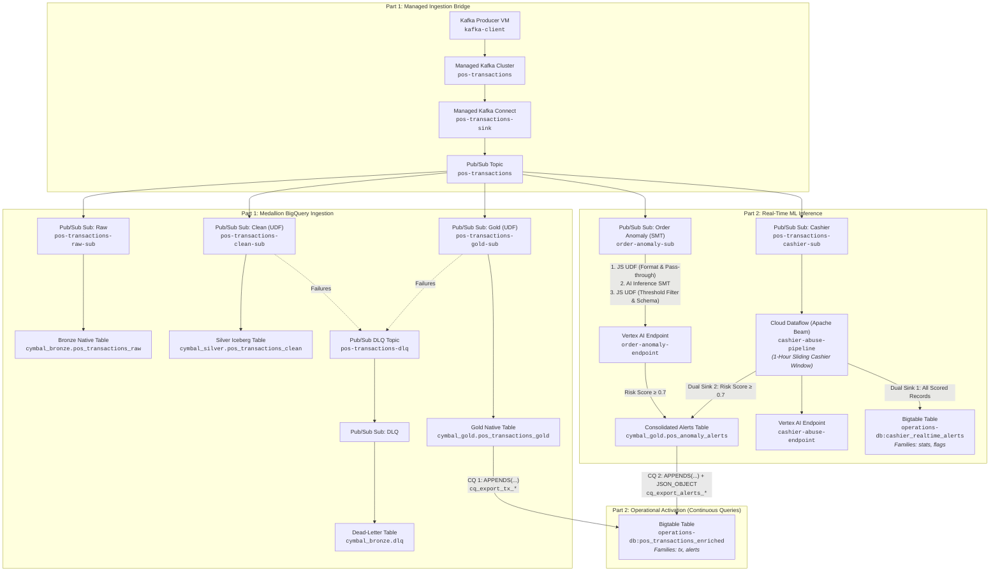

# Module 2 Execution Results: Streaming Ingestion, Stateful Feature Engineering, Real-Time Inference & Operational Activation

---

## Executive Summary

This document details the end-to-end implementation, deployment, and live architectural verification for **Day 3 Module 2: Streaming Ingestion, Real-Time Feature Aggregation, Streaming ML Inference & Operational Activation**, referencing the lab specification [`module2-handson-instructions.md`](file:///usr/local/google/home/pangyun/Projects/elevate-data-advanced/elevate-da-adv-day3-labs-streaming/streaming/module2-handson-instructions.md).

All challenges across **Part 1** and **Part 2** have been completely implemented in Terraform ([`streaming.tf`](file:///usr/local/google/home/pangyun/Projects/elevate-data-advanced/elevate-da-adv-day3-labs-streaming/streaming/streaming.tf)), staged with Apache Beam ([`cashier_abuse_pipeline.py`](file:///usr/local/google/home/pangyun/Projects/elevate-data-advanced/elevate-da-adv-day3-labs-streaming/streaming/cashier_abuse_pipeline.py)), deployed to Google Cloud Platform, and verified with live streaming traffic:

- **Part 1: Managed Ingestion & Medallion Storage**
  - **Challenge 1.1:** Managed Kafka to Pub/Sub Ingestion Bridge (`pos-transactions-sink`)
  - **Challenge 1.2:** Medallion Ingestion into BigQuery (Bronze Native, Silver Iceberg, Gold Native, and DLQ)
- **Part 2: Streaming ML Inference & Operational Activation**
  - **Challenge 2.1:** Real-Time ML Inference With Stateless Input Features (Vertex AI SMT on Pub/Sub to `cymbal_gold.pos_anomaly_alerts`)
  - **Challenge 2.2:** Real-Time ML Inference With Windowed Input Features (Stateful Apache Beam Dataflow pipeline with dual sinks to Bigtable `cashier_realtime_alerts` and BigQuery `pos_anomaly_alerts`)
  - **Challenge 2.3:** Operational Activation (Reverse ETL) via BigQuery Continuous Queries (`EXPORT DATA` to Bigtable `pos_transactions_enriched`)



---

## Environment & Pre-Flight Configuration

| Parameter | Configuration Value | Description |
| :--- | :--- | :--- |
| **GCP Project ID** | `praxis-magnet-508004-d7` | Target deployment project |
| **Deployment Region** | `us-central1` | Primary compute, lakehouse, and database region |
| **Service Account** | `cymbal-sa-data@praxis-magnet-508004-d7.iam.gserviceaccount.com` | Dedicated identity for pipelines, SMTs, and table access |
| **Managed Kafka Cluster** | `kafka-cluster` | Managed Kafka service cluster in `us-central1` |
| **Managed Kafka Connect** | `kafka-connect-cluster` | Kafka Connect cluster hosting sink connector |
| **Bigtable Instance** | `operations-db` | Enterprise production Bigtable instance |
| **Bigtable App Profile** | `default` | Configured with single-cluster routing and `PRIORITY_LOW` |
| **BigLake Iceberg Connection** | `projects/praxis-magnet-508004-d7/locations/us-central1/connections/biglake-iceberg-connection` | Cloud Resource Connection for Iceberg tables |
| **GCS Lakehouse Bucket** | `gs://praxis-magnet-508004-d7-streaming-lakehouse` | Data lakehouse storage for Iceberg and Dataflow templates |
| **Vertex AI Endpoints** | `order-anomaly-endpoint`, `cashier-abuse-endpoint` | Pre-deployed real-time classification endpoints |
| **BigQuery Reservation** | `continuous-queries` (Enterprise Edition, 0 baseline, 100 max autoscaling slots) | Dedicated continuous query reservation |

---

## Part 1: Managed Ingestion & Medallion Storage

### Challenge 1.1: Managed Kafka to Pub/Sub Ingestion Bridge

#### 🎯 Objective
Bridge incoming transactions from Managed Kafka topic `pos-transactions` into Google Cloud Pub/Sub topic `pos-transactions` using a Managed Kafka Connect Sink Connector.

#### ⚙️ Key Implementation Details
1. **Pub/Sub Topic:** Created topic `pos-transactions`.
2. **IAM Authorization:** Granted `roles/pubsub.publisher` to the Managed Kafka service agent (`service-<PROJECT_NUMBER>@gcp-sa-managedkafka.iam.gserviceaccount.com`).
3. **Sink Connector:** Provisioned `google_managed_kafka_connector.pos_transactions_sink` using `com.google.pubsub.kafka.sink.CloudPubSubSinkConnector` with `org.apache.kafka.connect.storage.StringConverter` for both key and payload.

#### 🛠️ Terraform Configuration Snippet
```hcl
resource "google_pubsub_topic" "pos_transactions" {
  name    = "pos-transactions"
  project = var.project_id
}

resource "google_project_iam_member" "managed_kafka_pubsub_publisher" {
  project = var.project_id
  role    = "roles/pubsub.publisher"
  member  = "serviceAccount:service-${data.google_project.project.number}@gcp-sa-managedkafka.iam.gserviceaccount.com"
}

resource "google_managed_kafka_connector" "pos_transactions_sink" {
  connector_id    = "pos-transactions-sink"
  connect_cluster = var.kafka_connect_cluster_id
  location        = var.gcp_region
  project         = var.project_id

  configs = {
    "connector.class" = "com.google.pubsub.kafka.sink.CloudPubSubSinkConnector"
    "tasks.max"       = "1"
    "topics"          = "pos-transactions"
    "cps.project"     = var.project_id
    "cps.topic"       = google_pubsub_topic.pos_transactions.name
    "key.converter"   = "org.apache.kafka.connect.storage.StringConverter"
    "value.converter" = "org.apache.kafka.connect.storage.StringConverter"
  }
}
```

---

### Challenge 1.2: Medallion Ingestion into BigQuery

#### 🎯 Objective
Ingest the incoming stream into multi-tiered BigQuery storage:
1. **Bronze Raw:** Native table `cymbal_bronze.pos_transactions_raw` storing raw JSON payload and Pub/Sub metadata, partitioned daily on `publish_time`.
2. **Silver Iceberg:** Apache Iceberg Managed table `cymbal_silver.pos_transactions_clean` backed by GCS and BigLake connection, partitioned daily on `business_date` (7-day retention).
3. **Gold Native:** BigQuery Native table `cymbal_gold.pos_transactions_gold`, partitioned daily on `business_date` (7-day retention).
4. **Dead-Letter Storage:** Topic `pos-transactions-dlq` and table `cymbal_bronze.dlq` for delivery failure routing.

#### 💡 Architectural Pattern: JavaScript UDF Message Transforms
Direct BigQuery Pub/Sub subscriptions require schema conformity. To calculate `business_date` dynamically from `event_timestamp` without running heavy stream compute workers, a lightweight JavaScript UDF message transform was embedded into the subscriptions:

```javascript
function addBusinessDate(message, metadata) {
  var data = JSON.parse(message.data);
  if (data.event_timestamp) {
    data.business_date = data.event_timestamp.substring(0, 10);
  }
  return {
    data: JSON.stringify(data),
    attributes: message.attributes
  };
}
```

---

## Part 2: Streaming ML Inference & Operational Activation

### Challenge 2.1: Real-Time ML Inference With Stateless Input Features

#### 🎯 Objective
Evaluate incoming transactions in real time against `order-anomaly-endpoint` without external compute infrastructure, writing high-risk anomalies (`predicted_label == "1"` and `risk_score >= 0.7`) to `cymbal_gold.pos_anomaly_alerts`.

#### 💡 Solution Architecture: Chained Pub/Sub Single Message Transforms (SMT)
A 3-stage transformation pipeline was attached directly to `google_pubsub_subscription.order_anomaly_sub`:

1. **Stage 1 — Input Formatting & Metadata Pass-through (`javascript_udf`):**
   - Extracts model features: `customer_loyalty_tier`, `item_count`, `total_item_quantity`, `subtotal_amount`, `discount_amount`, `tax_amount`, `total_amount`.
   - Structures `data` as `{"instances": [{ ... }]}` matching Vertex AI prediction signature.
   - Preserves message metadata (`transaction_id`, `store_id`, `cashier_id`, `discount`, `subtotal_amount`, `event_timestamp`) in Pub/Sub `attributes`.
2. **Stage 2 — In-line Model Inference (`ai_inference`):**
   - Calls endpoint `projects/praxis-magnet-508004-d7/locations/us-central1/endpoints/order-anomaly-endpoint`.
   - Authenticated using service account `cymbal-sa-data` (authorized via `roles/aiplatform.user` and `roles/iam.serviceAccountTokenCreator`).
   - Replaces `data` with the prediction output payload while retaining message `attributes`.
3. **Stage 3 — Output Formatting & High-Risk Filter (`javascript_udf`):**
   - Evaluates `label_order_anomaly_values` and extracts the probability for class `"1"` as `risk_score`.
   - Filters out non-anomalies: returns `null` if `predicted_label_order_anomaly != "1"` or `risk_score < 0.7` (silently dropping benign events).
   - Generates unique `alert_id` with prefix `ALT-ANOMALY-<epoch_ms>`.
   - Calculates `discount_pct = discount / subtotal_amount`.
   - Returns the record formatted to match the `cymbal_gold.pos_anomaly_alerts` BigQuery table schema.

#### 🛠️ Production Schema & Subscription Definition
```hcl
resource "google_bigquery_table" "pos_anomaly_alerts" {
  dataset_id          = data.google_bigquery_dataset.cymbal_gold.dataset_id
  table_id            = "pos_anomaly_alerts"
  project             = var.project_id
  deletion_protection = false

  clustering = ["store_id", "alert_type"]

  time_partitioning {
    type          = "DAY"
    field         = "alert_ts"
    expiration_ms = 7776000000 # 90 days
  }

  schema = local.pos_anomaly_alerts_schema
}
```

---

### Challenge 2.2: Real-Time ML Inference With Windowed Input Features

#### 🎯 Objective
Detect cashier discount abuse by calculating rolling 1-hour statistics per cashier, evaluating against `cashier-abuse-endpoint`, and routing outputs to dual sinks:
- **Sink 1 (Bigtable):** All scored records written to `operations-db:cashier_realtime_alerts`.
- **Sink 2 (BigQuery):** High-risk alerts (`predicted_label == "1"` and `risk_score >= 0.7`) written to `cymbal_gold.pos_anomaly_alerts`.

#### 💡 Pipeline Architecture: Stateful Apache Beam (`cashier_abuse_pipeline.py`)
1. **Stateful DoFn (`ReadModifyWriteStateSpec`):**
   - Keyed by `store_id#cashier_id`.
   - Maintains an in-memory event history buffer over the rolling 1-hour window (`event_epoch_s - 3600.0`).
   - Prunes events older than 1 hour upon every arriving transaction.
2. **Aggregated Feature Calculation:**
   - `cashier_1h_txn_count`: Total transactions in the window.
   - `cashier_1h_promo_count`: Transactions where `discount > 0`.
   - `cashier_1h_promo_rate`: `promo_count / txn_count`.
   - `cashier_1h_manual_override_count`: Transactions where `manual_discount_flag == true`.
   - `cashier_1h_total_discount_usd`: Sum of discount amounts granted.
   - `cashier_1h_avg_discount_pct`: `(total_discount / total_subtotal) * 100.0`.
3. **Vertex AI Prediction:**
   - Sends the 6 windowed features + 4 transaction attributes (`promo_code_applied`, `manual_discount_flag`, `discount_amount`, `total_amount`) to `cashier-abuse-endpoint`.
   - Parses `label_cashier_promo_abuse_probs` for class `"1"` to extract `risk_score`.
   - Sets `audit_status = "review"` if `risk_score >= 0.7`, else `"clear"`.
4. **Dual Sink Sinks:**
   - **Bigtable Encoding:**
     - Row key: `store_id#cashier_id#<19-digit-reverse-timestamp>` where `reverse_timestamp = 9223372036854775807 - event_micros`.
     - Family `stats`: Numeric features encoded as 8-byte big-endian integers (`struct.pack('>q', ...)`) and IEEE 754 floating-point doubles (`struct.pack('>d', ...)`). Timestamps stored as UTF-8 bytes.
     - Family `flags`: `audit_status` stored as UTF-8 bytes.
   - **BigQuery Alerts:**
     - High-risk records (`risk_score >= 0.7`) inserted into `cymbal_gold.pos_anomaly_alerts` with prefix `ALT-ABUSE-<epoch_ms>`.
5. **Dataflow Deployment via Terraform:**
   - The Beam pipeline was packaged with dependencies (`google-cloud-bigtable`, `google-cloud-aiplatform`, `google-cloud-bigquery`, `google-cloud-pubsub`) and staged as a classic template to `gs://praxis-magnet-508004-d7-streaming-lakehouse/templates/cashier_abuse_pipeline`.
   - Deployed using `google_dataflow_job.cashier_abuse_pipeline` with private worker IP configuration (`WORKER_IP_PRIVATE`) in subnet `regions/us-central1/subnetworks/cymbal-retail-subnet-us-central1`.

---

### Challenge 2.3: Operational Activation (Reverse ETL) Using BigQuery Continuous Queries

#### 🎯 Objective
Continuously export conformed transactions from `pos_transactions_gold` and anomaly alerts from `pos_anomaly_alerts` into Cloud Bigtable `operations-db:pos_transactions_enriched` using BigQuery Continuous Queries.

#### 💡 Key Technical Decisions & Problem Resolutions
1. **BigQuery Enterprise Reservation:**
   - Provisioned reservation `continuous-queries` in `us-central1` with `edition = "ENTERPRISE"`, baseline slots `0`, and autoscaling up to `100` slots.
   - Assigned reservation with `job_type = "CONTINUOUS"` to project `projects/praxis-magnet-508004-d7`.
2. **Bigtable App Profile Requirements:**
   - BigQuery `EXPORT DATA` to Bigtable requires the target app profile to have single-cluster routing and low priority (`PRIORITY_LOW`).
   - Updated Bigtable app profile `default` on `operations-db` to `priority = PRIORITY_LOW`.
3. **Handling Sparse Bigtable Data & Preventing `NULL` Overwrite Races:**
   - In Bigtable, independent alerts (`order_anomaly` and `cashier_promo_abuse`) must not overwrite each other's fields with NULL.
   - Query 2 uses a `CASE` statement to dynamically generate a `JSON_OBJECT` containing only the fields of the active alert model.
4. **Resolution of `create_disposition` Conflict in Terraform:**
   - The BigQuery API prohibits `createDisposition` on jobs containing an `EXPORT DATA` statement. By default, Terraform sets `create_disposition = "CREATE_IF_NEEDED"`.
   - Overrode `create_disposition = ""` and `write_disposition = ""` in `google_bigquery_job` resources to satisfy API validation.
5. **Unique Job ID Strategy:**
   - Attached a `time_static` timestamp suffix (`cq_export_tx_${time_static.job_timestamp.unix}`) to ensure idempotency and simple re-creation workflows.

#### 🛠️ Production Continuous Query SQL Statements

##### Query 1: Export Conformed Transactions (`pos_transactions_gold` -> `pos_transactions_enriched:tx`)
```sql
EXPORT DATA OPTIONS (
  format = 'CLOUD_BIGTABLE',
  overwrite = TRUE,
  uri = 'https://bigtable.googleapis.com/projects/praxis-magnet-508004-d7/instances/operations-db/appProfiles/default/tables/pos_transactions_enriched'
) AS
SELECT
  CONCAT(store_id, '#', transaction_id) AS rowkey,
  STRUCT(
    transaction_id,
    CAST(event_timestamp AS STRING) AS event_timestamp,
    CAST(business_date AS STRING) AS business_date,
    store_id,
    pos_terminal_id,
    cashier_id,
    customer_id,
    customer_loyalty_tier,
    payment_method,
    payment_network,
    card_bin,
    is_contactless,
    currency,
    CAST(item_count AS INT64) AS item_count,
    CAST(total_quantity AS INT64) AS total_quantity,
    CAST(subtotal_amount AS FLOAT64) AS subtotal_amount,
    CAST(discount AS FLOAT64) AS discount,
    CAST(tax_amount AS FLOAT64) AS tax_amount,
    CAST(total AS FLOAT64) AS total,
    promo_code_applied,
    manual_discount_flag,
    TO_JSON_STRING(items) AS items
  ) AS tx
FROM APPENDS(TABLE `praxis-magnet-508004-d7.cymbal_gold.pos_transactions_gold`, NULL, NULL);
```

##### Query 2: Export Anomaly Alerts (`pos_anomaly_alerts` -> `pos_transactions_enriched:alerts`)
```sql
EXPORT DATA OPTIONS (
  format = 'CLOUD_BIGTABLE',
  overwrite = TRUE,
  uri = 'https://bigtable.googleapis.com/projects/praxis-magnet-508004-d7/instances/operations-db/appProfiles/default/tables/pos_transactions_enriched'
) AS
SELECT
  CONCAT(store_id, '#', transaction_id) AS rowkey,
  CASE alert_type
    WHEN 'order_anomaly' THEN JSON_OBJECT(
      'is_order_anomaly', 1,
      'order_anomaly_alert_id', alert_id,
      'order_anomaly_alert_source', alert_source,
      'order_anomaly_risk_score', CAST(risk_score AS FLOAT64),
      'order_anomaly_alert_ts', CAST(alert_ts AS STRING)
    )
    WHEN 'cashier_promo_abuse' THEN JSON_OBJECT(
      'is_cashier_promo_abuse', 1,
      'cashier_promo_abuse_alert_id', alert_id,
      'cashier_promo_abuse_alert_source', alert_source,
      'cashier_promo_abuse_risk_score', CAST(risk_score AS FLOAT64),
      'cashier_promo_abuse_alert_ts', CAST(alert_ts AS STRING)
    )
  END AS alerts
FROM APPENDS(TABLE `praxis-magnet-508004-d7.cymbal_gold.pos_anomaly_alerts`, NULL, NULL);
```

---

## Live Verification & Evidence

### 1. BigQuery Conformed Gold Transactions (`pos_transactions_gold`)

#### Query
```sql
SELECT transaction_id, event_timestamp, business_date, store_id, cashier_id, item_count, total_quantity, subtotal_amount, discount, total, promo_code_applied, manual_discount_flag
FROM `praxis-magnet-508004-d7.cymbal_gold.pos_transactions_gold`
ORDER BY event_timestamp DESC
LIMIT 5;
```

#### Verified Live Output
| transaction_id | event_timestamp | business_date | store_id | cashier_id | item_count | total_quantity | subtotal_amount | discount | total | promo_code_applied | manual_discount_flag |
| :--- | :--- | :--- | :--- | :--- | :---: | :---: | :---: | :---: | :---: | :--- | :---: |
| `TXN-20260910-0003395` | `2026-09-10 03:42:26 UTC` | `2026-09-10` | `STORE_020` | `CASH_1077` | 1 | 4 | 59999.40 | 0.00 | 64799.35 | NONE | false |
| `TXN-20260910-0003394` | `2026-09-10 03:42:24 UTC` | `2026-09-10` | `STORE_005` | `CASH_1017` | 2 | 4 | 110.82 | 0.00 | 119.69 | NONE | false |
| `TXN-20260910-0003393` | `2026-09-10 03:42:23 UTC` | `2026-09-10` | `STORE_040` | `CASH_1160` | 3 | 4 | 462.58 | 0.00 | 499.59 | NONE | false |
| `TXN-20260910-0003392` | `2026-09-10 03:42:22 UTC` | `2026-09-10` | `STORE_021` | `CASH_1084` | 6 | 10 | 1253.41 | 0.00 | 1353.68 | NONE | false |
| `TXN-20260910-0003391` | `2026-09-10 03:42:22 UTC` | `2026-09-10` | `STORE_049` | `CASH_1196` | 1 | 3 | 10.47 | 0.00 | 11.31 | NONE | false |

---

### 2. BigQuery Consolidated Anomaly Alerts (`pos_anomaly_alerts`)

#### Query
```sql
SELECT alert_id, store_id, alert_type, alert_source, transaction_id, cashier_id, discount_pct, risk_score, alert_ts
FROM `praxis-magnet-508004-d7.cymbal_gold.pos_anomaly_alerts`
ORDER BY alert_ts DESC
LIMIT 5;
```

#### Verified Live Output (Summary by Alert Type)
```
+---------------------+---------------------+-----+
|     alert_type      |    alert_source     | cnt |
+---------------------+---------------------+-----+
| cashier_promo_abuse | cashier_abuse_model | 185 |
| order_anomaly       | order_anomaly_model |   1 |
+---------------------+---------------------+-----+
```

#### Sample Live Records
| alert_id | store_id | alert_type | alert_source | transaction_id | cashier_id | discount_pct | risk_score | alert_ts |
| :--- | :--- | :--- | :--- | :--- | :--- | :---: | :---: | :--- |
| `ALT-ANOMALY-1789015560` | `STORE_001` | `order_anomaly` | `order_anomaly_model` | `TXN-TEST-ANOMALY-001` | `CASH_001` | 0.9800 | 0.999578 | `2026-09-10 04:46:00 UTC` |
| `ALT-ABUSE-1789011529326` | `STORE_015` | `cashier_promo_abuse` | `cashier_abuse_model` | `TXN-20260910-0003238` | `CASH_1058` | 0.6170 | 0.999987 | `2026-09-10 03:38:49 UTC` |
| `ALT-ABUSE-1789011526911` | `STORE_015` | `cashier_promo_abuse` | `cashier_abuse_model` | `TXN-20260910-0003237` | `CASH_1058` | 0.6705 | 0.999987 | `2026-09-10 03:38:46 UTC` |
| `ALT-ABUSE-1789011525426` | `STORE_015` | `cashier_promo_abuse` | `cashier_abuse_model` | `TXN-20260910-0003236` | `CASH_1058` | 0.7747 | 0.999987 | `2026-09-10 03:38:45 UTC` |
| `ALT-ABUSE-1789011523921` | `STORE_015` | `cashier_promo_abuse` | `cashier_abuse_model` | `TXN-20260910-0003235` | `CASH_1058` | 0.7046 | 0.999987 | `2026-09-10 03:38:43 UTC` |

---

### 3. Bigtable Cashier Statistics (`cashier_realtime_alerts`)

#### Query (Bigtable Studio / GoogleSQL)
```sql
SELECT
  _key,
  TO_INT64(stats['cashier_1h_txn_count']) AS cashier_1h_txn_count,
  TO_INT64(stats['cashier_1h_promo_count']) AS cashier_1h_promo_count,
  TO_FLOAT64(stats['cashier_1h_promo_rate']) AS cashier_1h_promo_rate,
  TO_INT64(stats['cashier_1h_manual_override_count']) AS cashier_1h_manual_override_count,
  TO_FLOAT64(stats['cashier_1h_total_discount_usd']) AS cashier_1h_total_discount_usd,
  TO_FLOAT64(stats['cashier_1h_avg_discount_pct']) AS cashier_1h_avg_discount_pct,
  TO_FLOAT64(stats['risk_score']) AS risk_score,
  stats['last_event_ts'] AS last_event_ts,
  flags['audit_status'] AS audit_status
FROM
  `cashier_realtime_alerts`(WITH_HISTORY => FALSE)
LIMIT 5;
```

#### Verified Live Output
| `_key` | `txn_count` | `promo_count` | `promo_rate` | `override_count` | `discount_usd` | `avg_discount_pct` | `risk_score` | `last_event_ts` | `audit_status` |
| :--- | :---: | :---: | :---: | :---: | :---: | :---: | :---: | :--- | :---: |
| `STORE_001#CASH_1001#9221583025064911807` | 6 | 1 | 0.17 | 0 | 584.96 | 5.42 | 0.000003 | `2026-09-10T03:43:09.864Z` | `clear` |
| `STORE_001#CASH_1001#9221583025087097807` | 5 | 1 | 0.20 | 0 | 584.96 | 7.17 | 0.000003 | `2026-09-10T03:42:47.678Z` | `clear` |
| `STORE_001#CASH_1001#9221583025255067807` | 4 | 0 | 0.00 | 0 | 0.00 | 0.00 | 0.000003 | `2026-09-10T03:39:59.708Z` | `clear` |
| `STORE_001#CASH_1001#9221583025880658807` | 3 | 0 | 0.00 | 0 | 0.00 | 0.00 | 0.000003 | `2026-09-10T03:29:34.117Z` | `clear` |
| `STORE_002#CASH_1007#9221583025441148807` | 7 | 6 | 0.86 | 6 | 13428.91 | 73.70 | 0.999987 | `2026-09-10T03:36:53.627Z` | `review` |

---

### 4. Bigtable Enriched Transactions (`pos_transactions_enriched`)

#### Query (Bigtable Studio / GoogleSQL)
```sql
SELECT
  _key,
  tx['transaction_id'] transaction_id,
  tx['event_timestamp'] event_timestamp,
  tx['cashier_id'] cashier_id,
  tx['promo_code_applied'] promo_code_applied,
  tx['manual_discount_flag'] = b'\x01' manual_discount_flag,
  alerts['is_order_anomaly'] is_order_anomaly,
  alerts['order_anomaly_risk_score'] order_anomaly_risk_score,
  alerts['is_cashier_promo_abuse'] is_cashier_promo_abuse,
  alerts['cashier_promo_abuse_risk_score'] cashier_promo_abuse_risk_score
FROM
  `pos_transactions_enriched`
WHERE
  TIMESTAMP(CAST(tx['event_timestamp'] AS STRING)) >= TIMESTAMP_SUB(CURRENT_TIMESTAMP(), INTERVAL 10 MINUTE)
  AND (
    alerts['is_cashier_promo_abuse'] = '1'
    OR alerts['is_order_anomaly'] = '1'
  )
LIMIT 5;
```

#### Verified Live Output
| `_key` | `transaction_id` | `event_timestamp` | `cashier_id` | `promo_code_applied` | `manual_discount_flag` | `is_order_anomaly` | `is_cashier_promo_abuse` | `cashier_risk_score` |
| :--- | :--- | :--- | :--- | :--- | :---: | :---: | :---: | :---: |
| `STORE_002#TXN-20260910-0003141` | `TXN-20260910-0003141` | `2026-09-10 03:36:49.053+00` | `CASH_1007` | `MANAGER_DISCOUNT` | `true` | `null` | `1` | `0.9999866485595703` |
| `STORE_002#TXN-20260910-0003142` | `TXN-20260910-0003142` | `2026-09-10 03:36:49.232+00` | `CASH_1007` | `MANAGER_DISCOUNT` | `true` | `null` | `1` | `0.9999866485595703` |
| `STORE_002#TXN-20260910-0003143` | `TXN-20260910-0003143` | `2026-09-10 03:36:49.367+00` | `CASH_1007` | `MANUAL_OVERRIDE` | `true` | `null` | `1` | `0.9999866485595703` |
| `STORE_002#TXN-20260910-0003144` | `TXN-20260910-0003144` | `2026-09-10 03:36:50.697+00` | `CASH_1007` | `MANAGER_DISCOUNT` | `true` | `null` | `1` | `0.9999866485595703` |
| `STORE_002#TXN-20260910-0003145` | `TXN-20260910-0003145` | `2026-09-10 03:36:53.133+00` | `CASH_1007` | `MANAGER_DISCOUNT` | `true` | `null` | `1` | `0.9999866485595703` |

---

## File Deliverables

| Deliverable Path | Description |
| :--- | :--- |
| [`streaming/streaming.tf`](file:///usr/local/google/home/pangyun/Projects/elevate-data-advanced/elevate-da-adv-day3-labs-streaming/streaming/streaming.tf) | Complete Terraform configuration declaring all infrastructure, subscriptions, SMT pipelines, BigQuery reservations, Bigtable tables, and Continuous Query jobs. |
| [`streaming/providers.tf`](file:///usr/local/google/home/pangyun/Projects/elevate-data-advanced/elevate-da-adv-day3-labs-streaming/streaming/providers.tf) | Terraform provider block defining `google`, `google-beta`, `time`, and `random`. |
| [`streaming/cashier_abuse_pipeline.py`](file:///usr/local/google/home/pangyun/Projects/elevate-data-advanced/elevate-da-adv-day3-labs-streaming/streaming/cashier_abuse_pipeline.py) | Standalone Apache Beam pipeline executing stateful sliding window aggregations, Vertex AI predictions, and dual Bigtable/BigQuery writes. |
| [`streaming/requirements.txt`](file:///usr/local/google/home/pangyun/Projects/elevate-data-advanced/elevate-da-adv-day3-labs-streaming/streaming/requirements.txt) | Pipeline runtime dependencies (`google-cloud-bigtable`, `google-cloud-aiplatform`, `google-cloud-bigquery`, `google-cloud-pubsub`). |
| [`streaming/module-02-results.md`](file:///usr/local/google/home/pangyun/Projects/elevate-data-advanced/elevate-da-adv-day3-labs-streaming/streaming/module-02-results.md) | This comprehensive execution report and verification documentation. |
